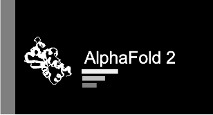

## Introduction

The Research Technology team at Tufts University has created several bioinformatics workshops that cover a variety of topics in the field. These trainings are designed to be asynchronous so that learners can move at their own pace.

## The Basics
  

 

## HPC Bioinformatics Workshops

        

## Galaxy Bioinformatics Workshops

 

