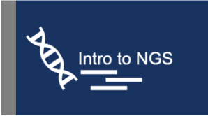

## Introduction

The Research Technology team at Tufts University has created several bioinformatics workshops that cover a variety of topics in the field. These trainings are designed to be asynchronous so that learners can move at their own pace.

## The Basics
  

## NGS Analysis

    

## Metagenomics Analysis

 

## Protein Structure Analysis

## Galaxy Bioinformatics Workshops

 

