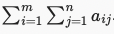
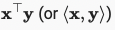
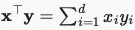
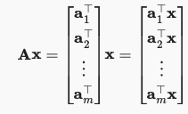
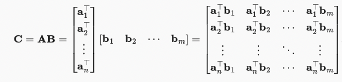

# Machine Learning Math Cheatsheet

| The Math Term | What it Means | 
|-|-|
| | x is a real number |
||x and y are real numbers between 0 and 1| 
| | x, y, and z are vectors| 
| | x is a vector with n real numbers| 
| | x is a vector with n elements | 
| | A is a matrix of real numbers with m rows and n columns| 
| | A is a matrix of real numbers with m rows and n columns| 
|  | matrix A at element ij (so the value at row i and column j)| 
|  | matrix A is transposed - rows become columns and columns become rows| 
|  | the hadamard product of matrix A and matrix B| 
|  | the sum of vector x from i to d | 
|  | the sum of two dimensional vector A with m rows and n columns | 
|  | thesum over the products of the elements at the same position| 
|  | thesum over the products of the elements at the same position| 
|  | a column vector of length m whose ith element is the dot product of ai T x|
|  | multiplying matrix A by matrix b. So for example you would get the dot product between the rows in matrix A and the columns in matrix B. (e.g. matrix A:5x4 and matrix:4x4 make a matrix:5x3)|
