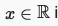
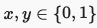
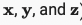
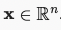
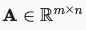
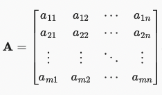
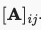
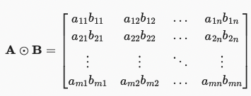
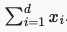

# Machine Learning Math Cheatsheet

| The Math Term | What it Means | 
|-|-|
| | x is a real number |
||x and y are real numbers between 0 and 1| 
| | x, y, and z are vectors| 
| | x is a vector with n real numbers| 
| | x is a vector with n elements | 
| | A is a matrix of real numbers with m rows and n columns| 
| | A is a matrix of real numbers with m rows and n columns| 
|  | matrix A at element ij (so the value at row i and column j)| 
|  | matrix A is transposed - rows become columns and columns become rows| 
|  | the hadamard product of matrix A and matrix B| 
|  | the sum of vector x from i to d | 
