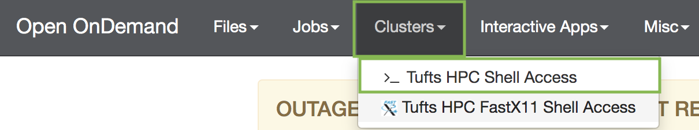
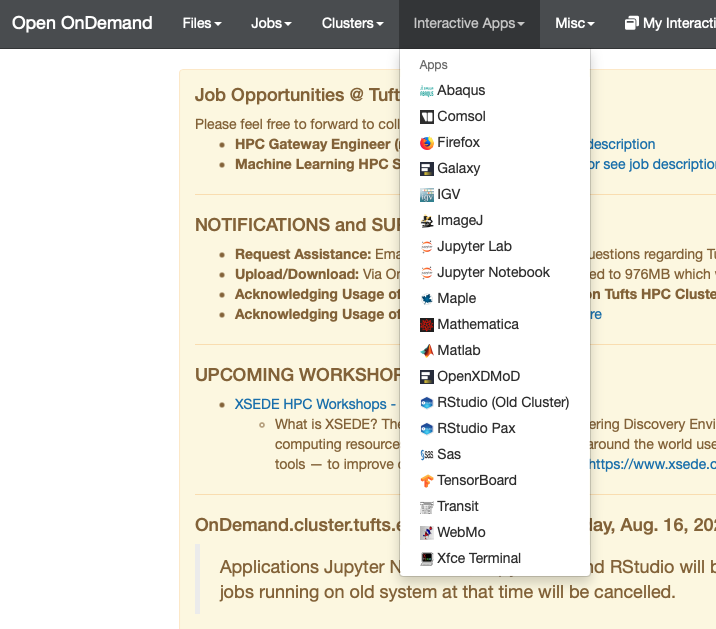

# Setup

## Log into the HPC cluster's On Demand interface

- Open a Chrome browser and navigate to the [OnDemand Interface](https://ondemand.pax.tufts.edu)
- Log in with your Tufts Credentials
- On the top menu bar choose `Clusters -> Tufts HPC Shell Access`



- You'll see a welcome message and a bash prompt, for example for user `tutln01`:

`[tutln01@login001 ~]$`

- This indicates you are logged in to the login node of the cluster. Type `clear` to clear the screen

## Storage Space

- Check how much available storage you have in your home directory by typing `showquota`:

```
Home Directory Quota
Disk quotas for user tutln01 (uid 31394):
     Filesystem  blocks   quota   limit   grace   files   quota   limit   grace
hpcstore03:/hpc_home/home
                  1222M   5120M   5120M            2161   4295m   4295m        


Listing quotas for all groups you are a member of
Group: facstaff	Usage: 16819478240KB	Quota: 214748364800KB	Percent Used: 7.00%
```
- **What does this mean?**

     - `blocks`: amount of storage you are using. Here it is 1222M
     - `quota`: amout of available storage. Here it is 5120M


> NOTE: If you do not have 500M available, you may have space in a project directory for your lab. These are located in `/cluster/tufts` with names like `/cluster/tufts/labname/username/`. If you don't know whether you have project space, please email [tts-research@tufts.edu](mailto:tts-research@tufts.edu).

## Download the data

- As of now we are on a login node. We **CANNOT** run our scripts on the login node. For that we need a compute node, and we can request one like so:

`srun --pty -t 3:00:00  --mem 16G  -N 1 --cpus 4 bash`

Where:

 - `srun` requests the pseudo terminal
 - `--pty bash` requests a bash terminal
 - `-t 3:00:00` requests 3 hours on that compute node
 - `--mem 16G` requests 16G of memory
 - `-N 1` requests 1 compute node
 - `--cpus 4` requests 4 cpus on that 1 compute node

 
> NOTE: If wait times are very long, you can try a different partitions by adding, e.g. `-p preempt` or `-p interactive` before `bash`.
If you go through this workshop in multiple steps, you will have to rerun this step each time you log in.

- Change to your home directory

     `cd `

     Or, if you are using a project directory:

     `cd /cluster/tufts/labname/username/`

- Copy the course directory and all files in the directory (-R is for recursive):   

     `cp -R /cluster/tufts/bio/tools/training/microbiome16S/ .`   

## Working with an Interactive App

Today we will be working with R. We can access R using the RStudio interactive app OnDemand. To do this we will:

- Go to `Interactive Apps -> RStudio Pax`



- Type in the number of hours you'll use the app for, how memory you'll need, what version of R you'll need, the reseveration, and any supporting modules. Here enter the following:
     - `hours`: 4
     - `memory`: 16G
     - `R version`: 4.0.0
     - `reservation`: Default
     - `supporting modules`: *don't enter anything here*
- Click `Launch` and an RStudio window will pop up

_________________________________________________________________________________________________________________________________________________________

[Next](./AmpliconSeq3.md)

[Previous](./AmpliconSeq1.md)
