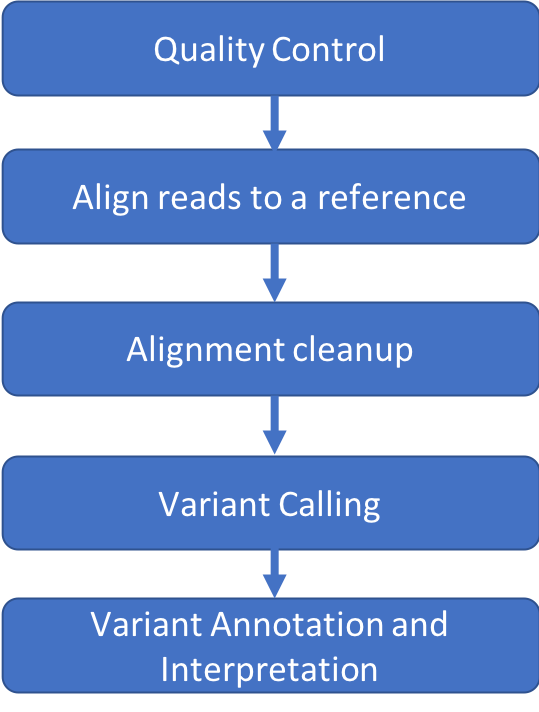

## Intro to Variant Calling

This course covers the basics of Variant Calling and interpretation for Next Gen sequencing data.

The material is designed to be a 3 hour workshop and is run on [Tufts High Performance Compute (HPC) Cluster](https://access.tufts.edu/research-cluster-account).
For support with this workshop or the HPC cluster, email TTS Research Technology [tts-research@tufts.edu](mailto:ltts-research@tufts.edu)

If you are taking this workshop on 5/19/20, please use [Piazza](https://piazza.com/tufts) for discussion.
The class is listed in term Summer 2020, 1: Intro to NGS Bioinformatics

## Goals

- Writing and running bash scripts on the HPC
- Intro to several bioinformatics tools: BWA, Samtools, Picard, GATK, VEP, IGV
- Variant Calling, Annotation and Interpretation using a Human Exome sample

## Prerequisites

### Computational skills needed

- Introduction to [Linux](https://tufts.box.com/s/x9aflewr2qw59pcbgcghbo9muykbi4ju)
- Introduction to [HPC](https://tufts.box.com/s/yubnzxnpih14hd80mbfxqrkdri8s2nws)

### Materials Needed

- Chrome web browser
- Account on [Tufts HPC](https://access.tufts.edu/research-cluster-account)
- [VPN](https://access.tufts.edu/vpn) if accessing the HPC from off campus

## Schedule

- [Introduction](slides/intro_to_ngs_bioinformatics_into_18May20.pdf)
- [Setup](lessons/01_Setup.md)
- [Quality Control](lessons/02_Quality_Control.md)
- [Alignment](lessons/03_Alignment.md)
- [Alignment Cleanup](lessons/04_Alignment_Cleanup.md)
- [Variant Calling](lessons/05_Variant_Calling.md)
- [Annotation and Interpretation](lessons/06_Variant_Annotation.md)

## Acknowledgement

This course was developed by Dr. Wewen Huo and Dr. Rebecca Batorsky at Tufts University and adapted from [HBC Training In Depth NGS Analysis Course](https://github.com/hbctraining/In-depth-NGS-Data-Analysis-Course)

The original course repo can be found [here](https://github.com/rbatorsky/intro-to-ngs-bioinformatics)

#### [Back To All Workshops](https://tuftsdatalab.github.io/Research_Technology_Bioinformatics/)
