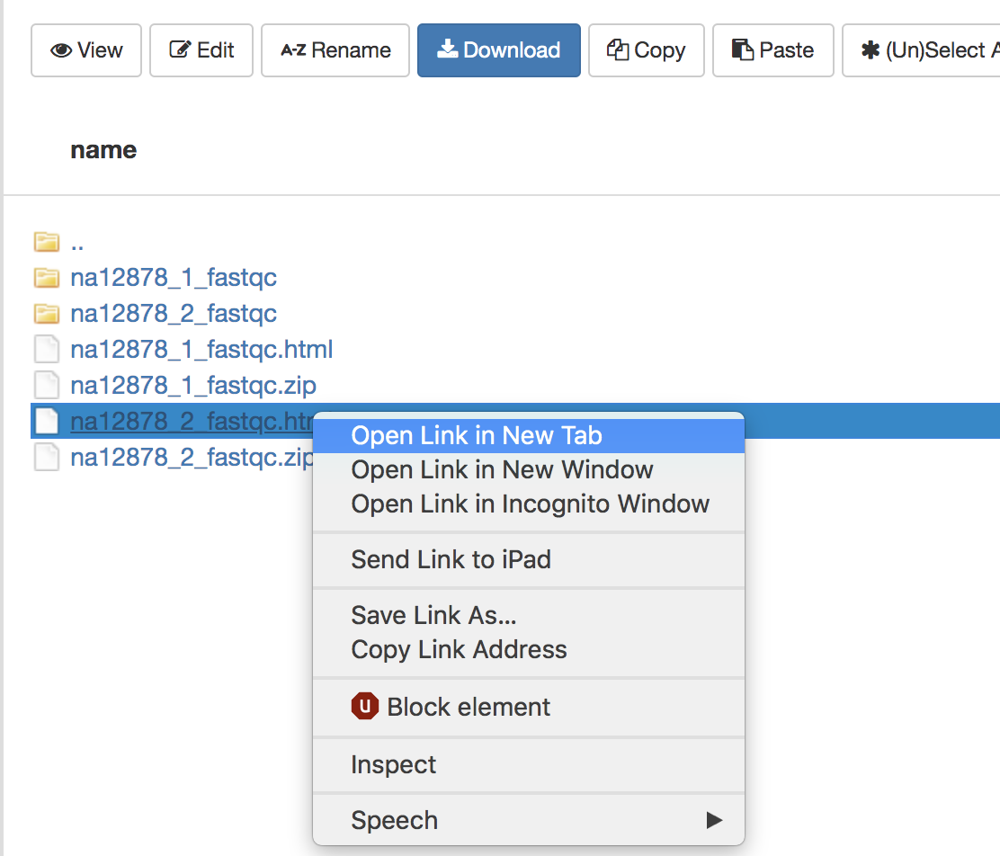
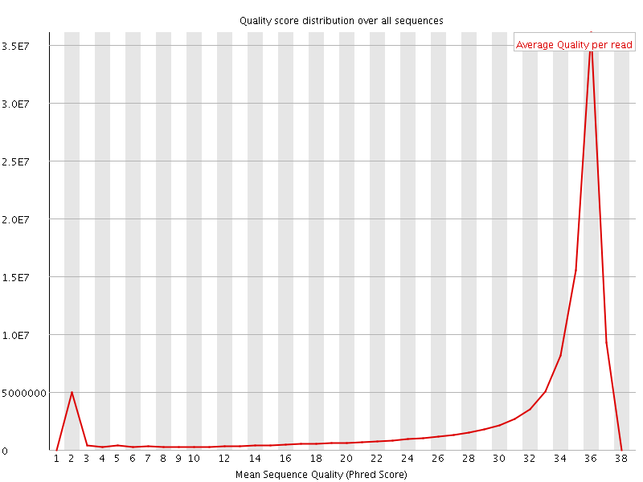
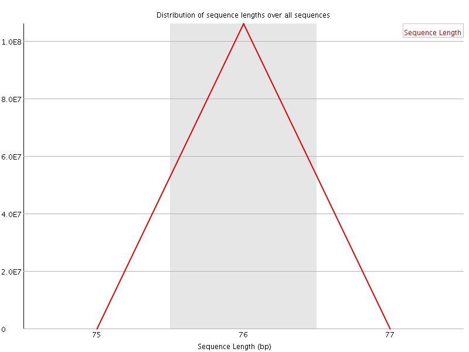
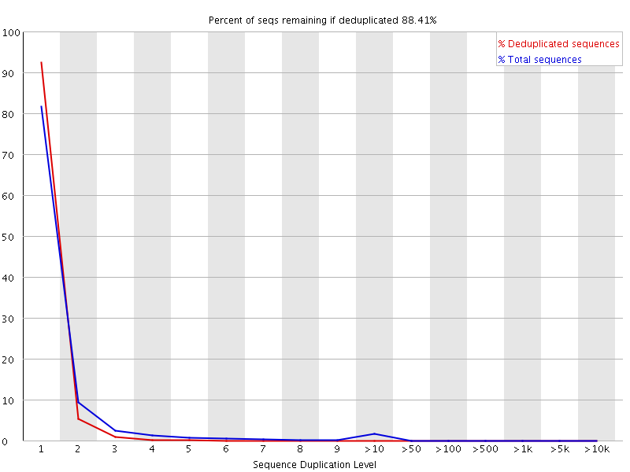

Approximate time: 20 minutes

## Goals
- Understand FASTQ file format
- Run FastQC to asses data quality

## Assess the quality of the raw data

### FASTQ format

FASTQ files is the most common way to store biological sequence data.
Depending on the sequencing protocol, a single FASTQ file can represent an entire flow cell, a single lane, a single sample, or a portion of a sample.
We have two FASTQ files in our `raw_data` folder, which are the paired end data of a single sample.

From our course directory `into-to-ngs` change into the `raw data` directory:
```markdown
cd raw_data
```

Use the command `head` to look at the first few lines of our first FASTQ file.

```markdown
head na12878_1.fq
```

Each read in our file is represented are by four lines: An identifier, the nucleotide sequence, an optional second identifier and a quality string.
Below is an example, the  arrows on the right show explanation of each line:

```bash
@SRR098401.109756285/1                   <-- Sequence identifier: @ReadID / 1 or 2 of pair
GACTCACGTAACTTTAAACTCTAACAGAAATATACTA…   <-- Sequence
+                                        <-- + (optionally lists the sequence identifier again)
CAEFGDG?BCGGGEEDGGHGHGDFHEIEGGDDDD…      <-- Quality String
```

### Base Quality Scores
The fourth line of each read is called the *quality string*.
Each symbol in the string is an encoding of the *quality score*, representing the inferred base call accuracy at that 
position in the read. 
The manufacturer of the sequencing instrument has performed calibration of quality score by sequencing many 
well-characterized samples from multiple organisms  and studying the correspondence between properties of the signal 
generated by the cluster being sequenced and the accuracy of the resulting base call.

The following two images explain this encoding.
The first image shows the mapping of the encoded quality score to the quality score:


The second image shows the mapping of the quality score to the inferred base call accuracy:


Looking back at our sample read, we can see that the first base has an encoded quality score of `C`.
Using the first image above, we see that C encodes a quality of 34.
Using the second table, we see that the probability is < 1/1000 of that base being an error.
In the next section, we'll see how quality scores and other quality control metrics are used to evaluate the quality of 
a sequenced sample. 

More information on Quality scores from [Illumina](https://www.illumina.com/content/dam/illumina-marketing/documents/products/technotes/technote_understanding_quality_scores.pdf)
 
## FastQC
FastQC is widely used tool for both DNA and RNA sequencing data in order to evaluate the quality of the sequencing data.

To use, load the module: 
```bash
module load fastqc/0.11.8
```

To see the input options, type:
```bash
fastqc --help
```

Result:
```bash
fastqc --help

            FastQC - A high throughput sequence QC analysis tool

SYNOPSIS

	fastqc seqfile1 seqfile2 .. seqfileN

    fastqc [-o output dir] [--(no)extract] [-f fastq|bam|sam] 
           [-c contaminant file] seqfile1 .. seqfileN
...
```

FastQC is run on each FASTQ file separately in order to be sensitive to the variation in quality over lanes, samples, 
and paired-end files.

Since FastQC can run on multiple files at once, we'll use a wildcard `*` to indicate each file in the folder `raw_data`, 
and we specify that the output should be placed in the directory we created called `fastqc`:

```bash
cd ..
mkdir fastqc
fastqc raw_data/* -o fastqc
```

Result:
```markdown
Started analysis of na12878_1.fq
Approx 20% complete for na12878_1.fq
Approx 40% complete for na12878_1.fq
Approx 65% complete for na12878_1.fq
Approx 85% complete for na12878_1.fq
Analysis complete for na12878_1.fq
Started analysis of na12878_2.fq
Approx 20% complete for na12878_2.fq
Approx 40% complete for na12878_2.fq
Approx 65% complete for na12878_2.fq
Approx 85% complete for na12878_2.fq
Analysis complete for na12878_2.fq
```

To view the resulting files:
```
ls fastqc
```

The result shows an `html` file showing graphical results and a `zip` file containing the raw data for each input FASTQ file.
The easist way to view the result is to open the `html` files in a web browser.
```
na12878_1_fastqc.html  na12878_1_fastqc.zip  na12878_2_fastqc.html  na12878_2_fastqc.zip
```
## View results in the On Demand browser

To view the graphical results, return to the tab [ondemand.cluster.tufts.edu](ondemand.cluster.tufts.edu)

On the top menu bar choose `Files->Home Directory`


Navigate to the `fastqc` folder in course directory, e.g.: `/home/username/intro-to-ngs/fastqc/`
Right click on the file `na12878_1_fastqc.html` and select `Open in new tab`.



The new tab that opens in the browser has the results of FastQC for the first reads in the sample.
We'll go through each plot.
Note that the plots shown are representative results for WES data of varying quality, rather than those generated 
on the course data.

### Per base sequence quality

The first plot shows the quality scores vs. position in the read, for all reads in the file.


For each position a Box and Whisker type plot is drawn. The elements of the plot are as
follows:
- The central red line is the median value
- The yellow box represents the inter-quartile range (25-75%)
- The upper and lower whiskers represent the 10% and 90% points
- The blue line represents the mean quality

The background of the graph divides the y axis into very good quality calls
(green), calls of reasonable quality (orange), and calls of poor quality (red). 
It is typical for reads generated by Illumina platforms to show reduced quality at the ends of reads due to fragments in
 a cluster becoming out-of-sync ([Fuller et al 2009](http://arep.med.harvard.edu/pdf/Fuller_09.pdf)).


### Per sequence quality scores
The Per Sequence Quality Score plots the distribution of mean sequence quality.
This plot allows will show a peak toward lower mean quality if there is a subset of sequences with  low quality values. 



### Per base sequence content
The Per Base Sequence Content plot shows the the proportion of each base called at each position in the read, 
for all reads in the file.


In a random library you would expect that bases would be present in equal proportions.
In any given genome, however, the relative amount of each base will reflect the overall amount of these bases
in your genome. In any case, we would expect the lines to run parallel to each other.
If you see strong biases which change in different bases then this usually indicates an
overrepresented sequence which is contaminating your library. Below is an example of a library that was contaminated 
with adapter dimers (from sequencing.qcfail.com)[https://sequencing.qcfail.com/articles/contamination-with-adapter-dimers/].


### Per sequence GC content

This plot displays the fraction of G and C bases across for all sequences in the file.
and compares it to a modelled normal distribution of GC content.


In a normal random library you would expect to see a roughly normal distribution of GC
content where the central peak corresponds to the overall GC content of the underlying
genome. The expected GC content is calculated from the observed data and used to build a reference distribution.
An unusually shaped distribution could indicate a contaminated library or some other kinds
of biased subset. A normal distribution which is shifted indicates some systematic bias
which is independent of base position.

### Per base N content

If a sequencer is unable to make a base call with sufficient confidence then it will normally
substitute an N rather than a conventional base. 
This plot shows the percentage of base calls at each position for which an N was substituted.


### Sequence Length Distribution

This plot shows the distribution of read sizes in the file.
Depending on the sequencing method and whether reads have been post-processed, it may be expected to have reads of a 
uniform length or varying lengths.
For our raw WES dataset we see a sharp peak at 76 bases, as expected.



### Sequence Duplication Levels

This plot shows the distribution of sequence duplicates in the file.
For example, in the below plot, over 80% of the total sequences are present only once and 10% are present twice.



In a diverse library most sequences will occur only once in the final set. A high
level of duplication may indicate low library complexity or an enrichment bias (e.g. PCR over
amplification).

### Overrepresented sequences

This plot shows the sequences in the file which make up more than 0.1% of the total.
A normal high-throughput library will contain a diverse set of sequences, with no individual
sequence making up a more than a tiny fraction of the whole. Finding that a single sequence is very
overrepresented in the set either means that it is highly biologically significant, or indicates
that the library is contaminated, or not as diverse as you expected.

For each overrepresented sequence the program will look for matches in a database of
common contaminants and will report the best hit it finds. Hits must be at least 20bp in
length and have no more than 1 mismatch. Finding a hit doesn't necessarily mean that this
is the source of the contamination, but may point you in the right direction. It's also worth
pointing out that many adapter sequences are very similar to each other so you may get a
hit reported which isn't technically correct, but which has very similar sequence to the
actual match.

If overrepresented sequences are found but not identified by FastQC, try a 
[BLAST search](https://blast.ncbi.nlm.nih.gov/Blast.cgi).

### Adapter Content

This module looks for common adapters in the sequence.


Explanations adapted from [https://dnacore.missouri.edu/PDF/FastQC_Manual.pdf][https://dnacore.missouri.edu/PDF/FastQC_Manual.pdf]

## Optional: Read trimming

In our `Per base sequence quality` we saw that the read quality dropped towards the end of the read.
In order to ensure alignment and variant calling are as accurate as possible, we can perform quality trimming of reads.

[Trim Galore](https://github.com/FelixKrueger/TrimGalore/blob/master/Docs/Trim_Galore_User_Guide.md) is a popular tool 
that in the default mode performs two types of trimming:
Quality trimming: Trims low quality bases from the 3' end of the read
Adapter trimming: Automatically detects and removes known Illumina adapters that may be present in the data

To perform trimming on the data, we first load the software which is installed as an a conda environment.
For more information on using anaconda on the HPC, see [this tutorial](https://sites.tufts.edu/biotools/files/2019/07/conda_on_hpc.pdf).

```
module load anaconda/3
source activate /cluster/tufts/bio/tools/conda_envs/trim_galore/
```

To run:
```
mkdir trim
trim_galore -o trim raw_data/*
```

Result:
```
...
=== Summary ===

Total reads processed:                   4,652
Reads with adapters:                     1,606 (34.5%)
Reads written (passing filters):         4,652 (100.0%)

Total basepairs processed:       353,552 bp
Quality-trimmed:                  24,906 bp (7.0%)
Total written (filtered):        326,448 bp (92.3%)
...
```

Note that Trim Galore may trim adapters [even in the case where FastQC found no adapters](https://github.com/FelixKrueger/TrimGalore/issues/15).
This is because Trim Galore will remove partial adapters at the ends of reads.

The result after trimming is much improved:
<img src="../img/fastqc_dup.png" width="4

[Next: Alignment](03_Alignment.md)

[Previous: Setup](01_Setup.md)
					
[Main Page](../README.md)
