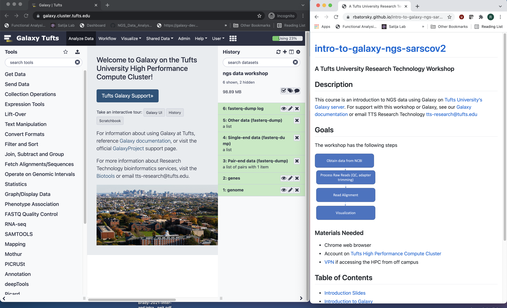
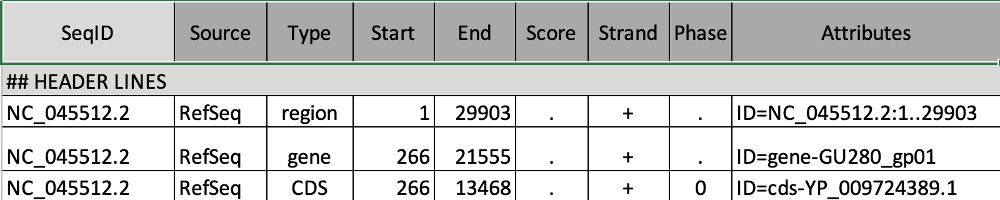
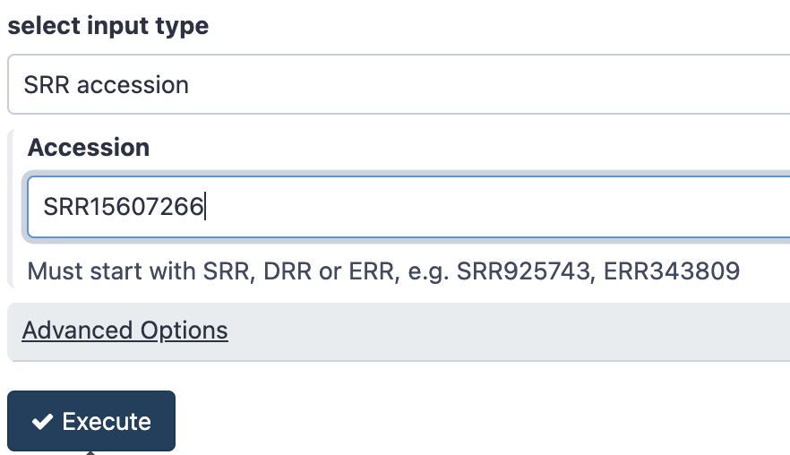
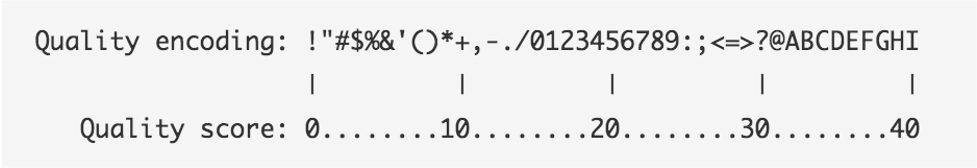

# Obtaining the Reference data and NGS Sequencing data from public repositories

The [US National Center for Biotechnology Information](https://www.ncbi.nlm.nih.gov/) hosts repositories for many types of biomedical and genomics information. Today we'll retrieve reference data from the [Genomes Database FTP server](https://ftp.ncbi.nlm.nih.gov/genomes/) as well as the [Sequence Read Archive](https://www.ncbi.nlm.nih.gov/sra) 

## Step 1: Galaxy Setup

### Log in to Galaxy
- Connect to Tufts Network, either on campus or via VPN

- Visit https://galaxy.cluster.tufts.edu/

- Log in with you cluster username and password

- In another browser window go to course website: 
[https://rbatorsky.github.io/intro-to-galaxy-ngs-sarscov2/](https://rbatorsky.github.io/intro-to-galaxy-ngs-sarscov2/)

- If you have one monitor, here is a suggested screen layout to follow the tutorial

*Suggested screen layout*


### Create a new history
- Click the **+** at the top of the history panel, on the right hand side of the screen
- To rename the history, click on the box **Unnamed History**, type **ngs data workshop**, and press enter


## Step 2: Obtaining our Data
Our dataset is a SARS-CoV-2 Next Generation Sequencing sample. In this section we'll obtain our reference data and our NGS reads in preparation for alignment.


### Import the SARS-CoV2 genome and gene annotation from a Shared Data library on our server
- On the top menu bar, click **Shared Data** and select **Data Libraries**
- Select **sars-cov-2 genome and annotation**
- Select both files by checking the box next to Name

<p align="center">

</p>

- Just under the top menu bar, next to the search bar, click **Export to History** and select **As Datasets**
- In the **Import into History** keep the current Selected History and click **Import**
- Click on **Galaxy Tufts** on the top left to go back to the main panel

You’ll see two datasets in your history. 
<p align="center">

</p>

### Fasta Format
The virus genome is in gzipped fasta format with the extension **fna.gz**. Fasta format has two parts, a sequence identifier preceeded by a ">" symbol, followed by the sequence on subsequent lines. You can see a preview of it by clicking on the **GCF_009858895.2_ASM985889v3_genomic.fna.gz** dataset in the History panel.

<p align="center">

</p>

### GFF Format
The Generic Feature Format (GFF) file tells us where features such as genes and exons are located in the reference genome.
To preview the GFF file, click on the   on the **GCF_009858895.2_ASM985889v3_genomic.gff** dataset.
Note that we must always be sure that our gene information and genome come from the same source.
<p align="center">

</p>


## Step 3: Import NGS sequencing data from Sequence Read Archive

We are interested in obtaining reads from the sample [Viral genomic RNA sequencing of a B.1.617.2/Delta isolate; Severe acute respiratory syndrome coronavirus 2; RNA-Seq](https://www.ncbi.nlm.nih.gov/sra/?term=SRR15607266)
<p align="center">

</p>

### Download Reads

We'll download the data from Sequence Read Archive using a Galaxy tool called **SRA Toolkit**.

- In the Tool panel (left hand side) search box, type in "fasterq" and click on the tool under **SRA toolkit** called **Faster Download and Extract Reads in FASTQ**
- Under **Accession** enter `SRR15607266`
- Click **Execute**

<p align="center">

</p>

- The result will be four items in History
  - Log: information about the total reads downloaded
  - Other data: Empty, but can contain experiment metadata
  - Single-end data: Empty, since this experiment has no single-end files
  - Paired-end data: Two files, containing the forward and reverse reads for this sample 

<p align="center">

</p>

### Fastq format
Fastq format is a way to store both sequence data and information about the quality of each sequenced position.

- To view:
  - Click on the list **Pair-end data (fasterq-dump)** and the sublist **SRR15607266** to expand the sample, you’ll see 2 sequencing files **forward** and **reverse**

  - Click on the  on the first sequence file **forward** and look at the fastq reads

  - The paired end data contains two files, forward and reverse reads for our sample.


The first 4 lines constitute the first sequencing read:
```
@SRR15607266.1 1 length=76
NTTATCTACTTTTATTTCAGCAGCTCGGCAAGGGTTTGTTGATTCAGATGTAGAAACTAAAGATGTTGTTGAATGT
+SRR15607266.1 1 length=76
#8ACCGGGGGGGGGGGGGGGGGGGGGGGGGGGGGGGGGGGGGGGGGGGGGGGGGGGGGGGGGGGGGGGGGGGGGGG
```

1. Sequence identifier
2. Sequence
3. \+ (optionally lists the sequence identifier again)
4. Quality string

Paired end sequencing data will typically be stored as two fastq files, one for the forward and one for the reverse.  Each file should contain the same number of reads, with the same labels, in the same order. If this convention is not followed, it could cause errors with downstream tools. Fortunately there are tools such as [BBTools Repair](https://jgi.doe.gov/data-and-tools/bbtools/bb-tools-user-guide/repair-guide/) that can help restore pairing information.

### Base Quality Scores

The symbols we see in the read quality string are an encoding of the quality score:

<p align="center">

</p>

A quality score is a prediction of the probability of an error in base calling: 

<p align="center">

</p>

Going back to our read, we can see that for most of our read the quality score is "G" –> "Q" =  38 -> Probability < 1/1000 of an error.


[Next: Process Raw Reads](02_Process_raw_reads.md)

[Previous: Introduction to Galaxy](00_Galaxy_introduction.md)
