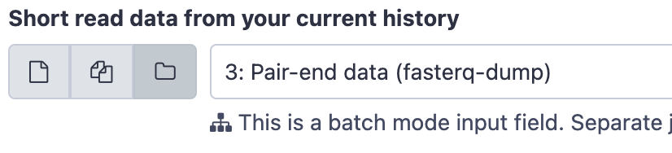
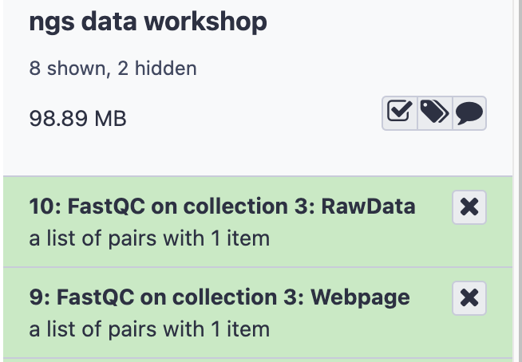
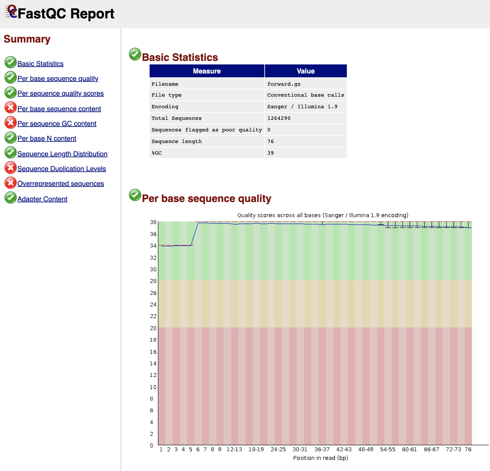

# Perform Quality Control on Raw Reads

Next Generation Sequencing can produce a large number of reads in each experiment, giving low-cost and in-depth information about the underlying RNA or DNA sample. However, every platform will produce errors (incorrect nucleotides in the sequence). Hence, quality control is an important step in data analysis. 

Note: The following steps will walk you through how to run the tools. In each step certain parameters are set. If a parameter option appears on the screen but this tutorial doesn't mention how to set it, leave it at the default. 

## Step 1: FastQC

FastQC provides several modules to asses the quality of sequencing data. 
- Sequence Quality
- GC content
- Per base sequence content
- Adapters in Sequence

The [FastQC Slides](../slides/intro_ngs_galaxy_sarscov2_1hr_fastqc.pdf) give an overview of these modules in the context of RNA sequencing data.

### Run FastQC

- In the **Tools** panel search bar, type **FastQC**
- Select **FastQC Read Quality reports** under **FASTQ Quality Control**
- In the **Main** panel, under **Short read data from your current history** select the folder icon  and the dataset **3:Pair-end data (fasterq-dump)** will appear as an option

- Scroll down and click **Execute**.The job should first appear orange and then green after a minute or so.
- The result will be two lists, one containing the raw data and one the webpage (html) results for convenient viewing in the browser.

- Click to expand the second list **FastQC on collection 3: Webpage**
- Click on the collection **SRR15607266**
- Click on the  icon next to the first file for sample **forward**. The first table gives **Basic Statistics** of the sample. The Main panel will show metrics and plots. You may have to adjust the size of the panel in order to view.

### (Optional) Trim adapters and low quality read ends with Trim Galore!
- In the **Tools** panel search bar, type **Trim Galore!**
- Select **Trim Galore!** under **FASTQ Quality Control**
- Under **Reads in FASTQ format** click the  and select **3: Pair-end data (fasterq-dump)**
- Scroll down and click **Execute**.
- The result will be a single collection titled **Trim Galore! on collection 3: trimmed reads**.
- Follow the steps for **Run FastQC** above, except select the trimmed reads generated in the previous step as the input to **FastQC**
- Check to see which modules have changed with the trimmed reads.

[Next: Read Alignment](03_Read_alignment.md)

[Previous: Obtain Data](01_Obtain_Data.md)
