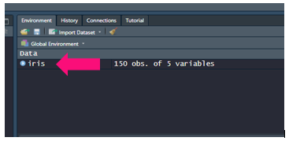
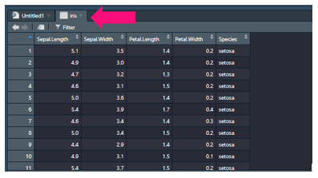

# Importing Data

When importing data we use a few common functions:

* ```read.csv()``` - to read in .csv files or files separated by commas/```,```
* ```read.table()``` - to read files separated by delimiters other than commas - like spaces/```" "```, tabs/```"/t"```, semicolons/```";"```, etc.
* ```openxlsx::read.xlsx()``` - to read excel files

You'll note that ```read.xlsx()``` has the prefix ```openxlsx::```. This is because the ```read. xlsx()``` function is not avaiable with base R. To get this function you will need to install a new package. To do so you'll enter this general formula into the console:

    install.packages("packageToInstall")

So to install the ```openxlsx``` package all you'll need to do is write out ```install.packages("openxlsx")```. Installing packages aside, let's dive into how to use each function described above.

## read.csv()

When importing .csv files you'll need to specify the path to where you're file is located. So if your .csv file is in ```/Documents/test.csv```, you can download it like so:

    test <- read.csv("/Documents/test.csv")

We can also extend this to URL's as well:

    url_test <- read.csv(url("http://plugins.biogps.org/download/human_sample_annot.csv"))

Once you have data loaded you will see it in your environment window:



You can click this to inspect your data and it will appear in your script editor window:



## read.table()

Like ```read.csv()```, ```read.table()``` can also import data. The latter function is very useful in that it can download files not delimted (a.k.a separated) by commas. So to open a ".tsv" file (a.k.a a file delimeted by a tab/```"/t"```):

    tsv_test <- read.table("/Documents/test.tsv",sep="\t",stringsAsFactors=FALSE)

You'll notice in the code above that we include the option, ```stringsAsFactors=FALSE```. If this was set to ```TRUE``` it would coerce your character columns into factor columns and this isn't always desired. So here we explicitly say ```stringsAsFactors=FALSE``` to be safe.

## read.xlsx()

While files like the ones mentioned above are popular, so are excel spreadsheets. So it is worth mentioning how to read in excel data as well. However, to do wo we will need pull in the package ```openxlsx```, which we did above by entering ```install.packages("openxlsx")```. To use this package we can do one of the following:

  * call it for every function we use: ```openxlsx::read.xlsx("/Documents/test.xlsx")```
  * load the entire library of functions:
   
       library(openxlsx)
      
      xlsx_test <- read.xlsx("/Documents/test.xlsx")
      
Often times we just load in the whole library, if we were writing our own package we would try and call it for every function we use for traceability reasons. Now in excel spreadsheets you may only want to pull out one page or start from a row that isn't the first. To do so you can use:

     library(openxlsx)

     xlsx_test <- read.xlsx("/Documents/test.xlsx",sheet=2,startRow = 5,colNames = TRUE,rowNames = FALSE)

So here we are pulling: the document "/Documents/test.xlsx", the second sheet, starting from the fifth row, specifying we do have column names, specifying we do not have row names. 

## Inspecting Data

Now before we go about manipulating it let's inspect it. For training purposes we will inspect a base training dataset in R called iris:

To get a summary of each column:

    summary(iris)

    Sepal.Length    Sepal.Width     Petal.Length    Petal.Width          Species  
    Min.   :4.300   Min.   :2.000   Min.   :1.000   Min.   :0.100   setosa    :50  
    1st Qu.:5.100   1st Qu.:2.800   1st Qu.:1.600   1st Qu.:0.300   versicolor:50  
    Median :5.800   Median :3.000   Median :4.350   Median :1.300   virginica :50  
    Mean   :5.843   Mean   :3.057   Mean   :3.758   Mean   :1.199                  
    3rd Qu.:6.400   3rd Qu.:3.300   3rd Qu.:5.100   3rd Qu.:1.800
    Max.   :7.900   Max.   :4.400   Max.   :6.900   Max.   :2.500
    

To get the data's class:

    class(iris)

    data.frame

To get a display of the data's contents:

    str(iris)

    data.frame:	150 obs. of  5 variables:
    $ Sepal.Length: num  5.1 4.9 4.7 4.6 5 5.4 4.6 5 4.4 4.9 ...
    $ Sepal.Width : num  3.5 3 3.2 3.1 3.6 3.9 3.4 3.4 2.9 3.1 ...
    $ Petal.Length: num  1.4 1.4 1.3 1.5 1.4 1.7 1.4 1.5 1.4 1.5 ...
    $ Petal.Width : num  0.2 0.2 0.2 0.2 0.2 0.4 0.3 0.2 0.2 0.1 ...
    $ Species     : Factor w/ 3 levels "setosa","versicolor",..: 1 1 1 1 1 1 1 1 1 1 ...
    
 
To get the first 6 rows:

    head(iris)
 
    Sepal.Length Sepal.Width Petal.Length Petal.Width Species
    1          5.1         3.5          1.4         0.2  setosa
    2          4.9         3.0          1.4         0.2  setosa
    3          4.7         3.2          1.3         0.2  setosa
    4          4.6         3.1          1.5         0.2  setosa
    5          5.0         3.6          1.4         0.2  setosa
    6          5.4         3.9          1.7         0.4  setosa
    

To get the last 6 rows:

    tail(iris)

    Sepal.Length Sepal.Width Petal.Length Petal.Width   Species
    145          6.7         3.3          5.7         2.5 virginica
    146          6.7         3.0          5.2         2.3 virginica
    147          6.3         2.5          5.0         1.9 virginica
    148          6.5         3.0          5.2         2.0 virginica
    149          6.2         3.4          5.4         2.3 virginica
    150          5.9         3.0          5.1         1.8 virginica
    

To get the length of a vector:

    length(iris$Sepal.Length)
    
    150

To get the dimensions of a matrix/data frame:

    dim(iris)


    150 5 #(so this would be 150 rows and 5 columns)

To get the number of columns/rows:

    ncol(iris)
    
    5

    nrow(iris)

    150

To get your column names:

    colnames(iris)

    Sepal.Length" "Sepal.Width"  "Petal.Length" "Petal.Width"  "Species"

To get your row names:

    rownames(iris)

    "1"   "2"   "3"   "4"   "5" ...

Now that we know how to import our data and inspect it, we can go ahead and manipulate it!


_________________________________________________________________________________________________________________________________________________________________________________

Next Workshop: [Manipulating Data](../ManipulatingData/ManipulatingData.md)

[Main Page](../IntroToR.md)


