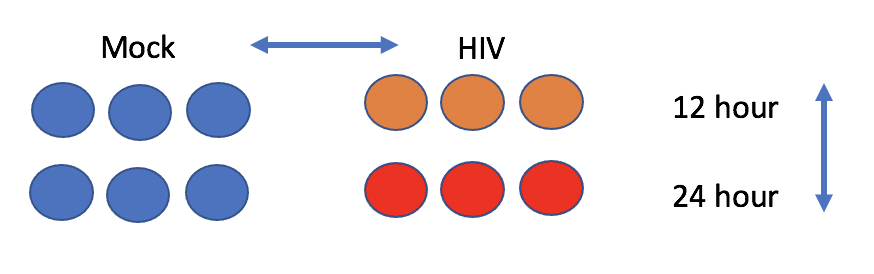
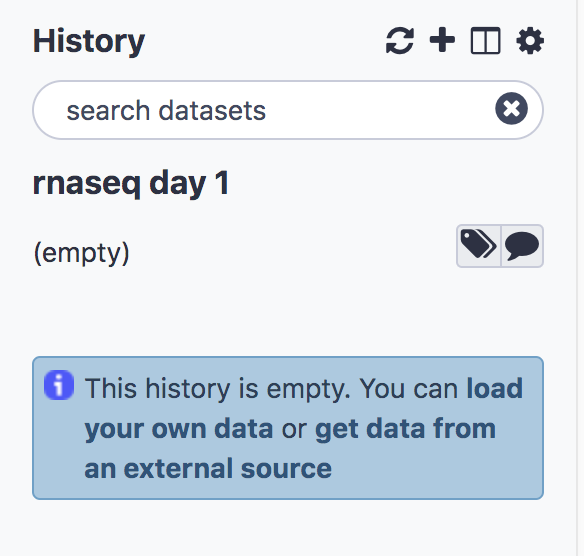
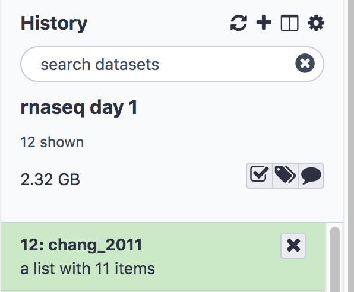
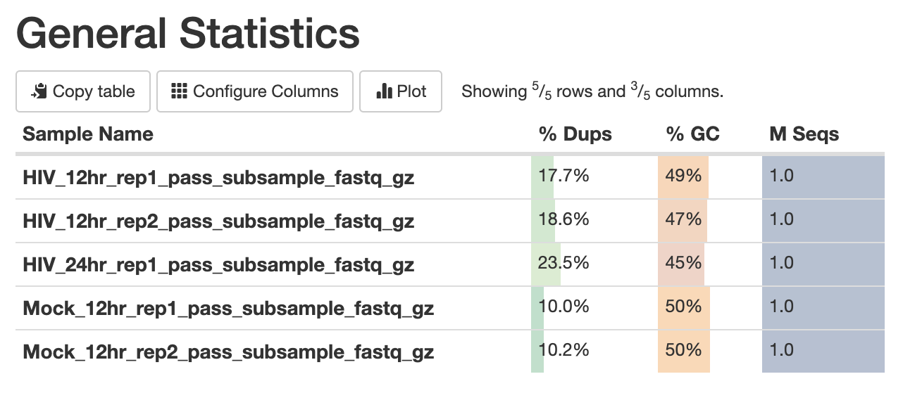
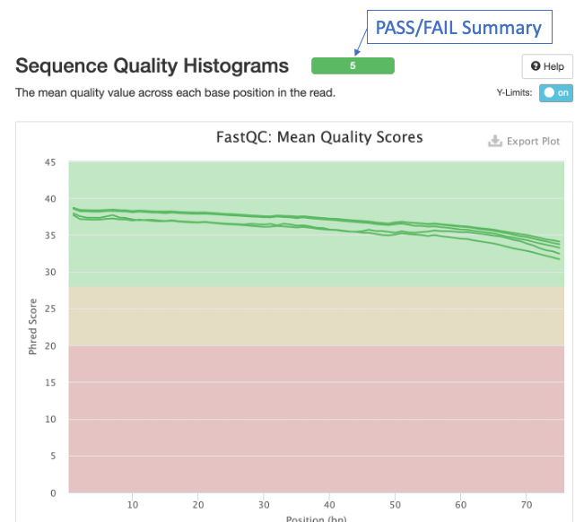

# Import Raw Reads from Shared Library

The introductory [Slides](../slides/slides_workshop_bioe291_14Dec21.pdf) give an overview of RNAseqencing technologies and our workflow.

## Dataset
Our dataset is from the publication:

Chang et al. **Next-Generation Sequencing Reveals HIV-1-Mediated Suppression of T Cell Activation and RNA Processing and Regulation of Noncoding RNA Expression in a CD4+T Cell Line.** mBio 2011doi: 10.1128/mBio.00134-11

The experiment aims to compare the mRNA produced by Mock and HIV infected CD4+ T cells, both 12 hr and 24 hr after infection.

 

The following steps will walk you through how to run tools needed for our workflow. In each step certain parameters are set. If a parameter option appears on the screen but this tutorial doesn't mention how to set it, leave it at the default. There are questions throughout, which serve to guide you through the results and check your understanding.


## Create a new history
- Click the **+** at the top of the history panel
- To rename the history, click on the box **Unnamed History** and type **rnaseq day 1** and press enter



## Import the raw data from a shared data library on our server
We'll import The raw reads from a shared library on our server. They have been downsampled to 1 million reads per file in order to speed up computation. The full dataset is available from NCBI under accession [SRP013224](https://www.ncbi.nlm.nih.gov/sra?term=SRP013224).

- On the top menu bar, click **Shared Data** and select **Data Libraries**
- Select **chang_2011_2rep**
- Just under the top menu bar, next to the search bar, click **Export to History** and select **As a Collection**. You'll see a list of fastq files.
- Click **Continue** to add all files as a list to our current history (No need to click on individual files)
- Name the collection **chang_2011**
- Click **Create list**
- Click on **Galaxy Tufts** on the top left to go back to the main panel.

You’ll see the collection (or list) **chang_2011** in your history. 




## View Fastq files
- Click on the list **chang_2011** to expand, you’ll see 5 sequencing files with extension **fastq.qz**. These are two 12 hr HIV replicates, two 12 hr Mock replicates, and one 24 hour HIV replicate.
- Click on the **eye icon**  on the first sequence file **HIV_12hr_rep1** and look at the fastq reads

The first 4 lines constitute the first sequencing read:
```
@SRR497699.30343179.1 HWI-EAS39X_10175_FC61MK0_4_117_4812_10346 length=75
CAGATGGCCGCAGAGGAAGCCATGAAGGCCCTGCATGGGGAGATCGGAAGAGCGGTTCAGCAGGAATGCCGAGAC
+
IIIIGIIHFIIIIBIIDII>IIDHIIHDIIIGIFIIEIGIBDDEFIG<EIEGEEG;<DB@A8CC7<><C@BBDDB
```

1. Sequence identifier
2. Sequence
3. + (optionally lists the sequence identifier again)
4. Quality string


# Perform Quality Control on Raw Reads

FastQC provides several modules (as discussed in intro [Slides](../slides/slides_workshop_bioe291_14Dec21.pdf))
- Sequence Quality
- GC content
- Per base sequence content
- Adapters in Sequence

## Run FastQC

- In the **Tools** panel search bar, type **FastQC**
- Select **FastQC** under **FASTQ Quality Control**
- In the **Main** panel, under **Short read data from your current history** select the folder icon  and the dataset **chang_2011** will appear as an option


- Scroll down and click **Execute**.The job should first appear orange and then green after a minute or so.
- The result will be two lists, one containing the raw data and one the webpage (html) results for convenient viewing in the browser.


- Click to expand the second list **FastQC on collection 12: Webpage** and click on the  next to the first file for sample **HIV_12hr_rep1**. The first table gives **Basic Statistics** of the sample. The Main panel will show metrics and plots. You may have to adjust the size of the panel in order to view.


<details>
<summary><b>Question 1: How many sequences are in the sample **HIV_12hr_rep1**? What is their average length? </b></summary>
<br>
</details>


## Aggregate QC data with **MultiQC**

The tool **MultiQC** allows us to view our QC results from all samples side by sides, in order to check for consistency across replicates. It can use the **Raw Data** output from FastQC and generate plots for all modules.

Steps to run:
- In the **Tools** panel search bar, type **MultiQC**
- Select **MultiQC** under **FASTQ Quality Control**
- In the middle panel, under **Which tool was used generate logs?** select **FastQC**
- Under **FastQC output** click the  and select the collection **14: FastQC on collection 12: Raw Data** (note that the numbers 14 and 12 are tracking the dataset number in your history and might vary if you have not followed the exact sequence in this document)
- Enter the **Report Title** “Raw data QC”
- Scroll down and click **Execute**.
- The result will again be two collections (you may have to click "back to rnaseq day 1" on the top of the History panel). Select the collection titled **MultiQC on data 36, data 34, and others: Webpage** and click the  to view.

The first panel gives summary statistics:



The second figure is a bar graph showing "Sequence Counts" of unique and duplicate reads for each sample. The remaining figures show each FastQC metric, displaying all samples on a single graph. There is a rectangle at the top that summarizes the pass/fail status of samples. 




<details>
<summary><b>Question 2: Which metrics show one or more failed samples?</b></summary>
<br>
</details>

## Trim adapters and low quality read ends with Trim Galore!
- In the **Tools** panel search bar, type **Trim Galore!**
- Select **Trim Galore!** under **FASTQ Quality Control**
- Under **Reads in FASTQ format** click the  and select **chang_2011**
- Scroll down and click **Execute**.
- The result will be a single collection titled **Trim Galore! on collection 12: trimmed reads**. Next, we’ll rerun FastQC in order to see how the trimming performed

## Rerun FastQC and MultiQC
- Follow the steps for **Run FastQC** and **Aggregate QC data with MultiQC** above, except select the trimmed reads generated in the previous step as the input to **FastQC**

<details>
<summary><b>Question 3: Were any reads completely removed from the samples? Note:The MultiQC "General Statistics" tables shows a rounded value, so use the "Sequence Counts" graph. </b></summary>
<br>
</details>

<details>
<summary><b>Question 4: Is the adapter problem solved? What about the GC content? Note: HIV replication is ramping up rapidly in these cells in the first 24 hours.</b></summary>
<br>
</details>

[Next: Read Alignment](03_Read_alignment.md)

[Previous: Introduction to Galaxy](00_Galaxy_introduction.md)

[Main Page](../README.md)
