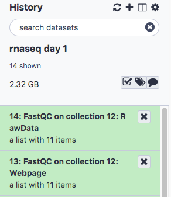
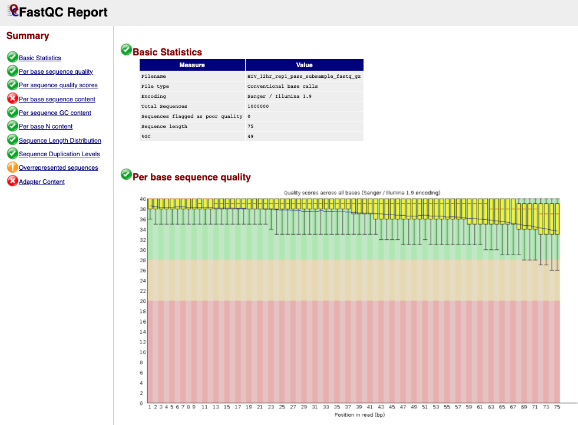

# Perform Quality Control on Raw Reads

# Introduction to FastQC

FastQC provides several modules (as discussed in intro [Slides](../slides/slides_workshop_12Apr21.pdf))
- Sequence Quality
- GC content
- Per base sequence content
- Adapters in Sequence

## Run FastQC

- In the **Tools** panel search bar, type **FastQC**
- Select **FastQC** under **FASTQ Quality Control**
- In the **Main** panel, under **Short read data from your current history** select the folder icon  and the dataset **chang_2011** will appear as an option

- Scroll down and click **Execute**.The job should first appear orange and then green after a minute or so.
- The result will be two lists, one containing the raw data and one the webpage (html) results for convenient viewing in the browser.

- Click to expand the second list **FastQC on collection 12: Webpage** and click on the  next to the first file for sample **HIV_12hr_rep1**. The first table gives **Basic Statistics** of the sample. The Main panel will show metrics and plots. You may have to adjust the size of the panel in order to view.

<b>Question 2: Were you right about your guess of quality encoding? </b>

 

## Aggregate QC data with **MultiQC**

The tool **MultiQC** allows us to view our QC results from all samples side by sides, in order to check for consistency across replicates.
It can use the **Raw Data** output from FastQC and generate plots for all modules.

Steps to run:
- In the **Tools** panel search bar, type **MultiQC**
- Select **MultiQC** under **FASTQ Quality Control**
- In the middle panel, under **Which tool was used generate logs?** select **FastQC**
- Under **FastQC output** click the  and select the collection **14: FastQC on collection 12: Raw Data** (note that the numbers 14 and 12 are tracking the dataset number in your history and might vary if you have not followed the exact sequence in this document)
- Enter the **Report Title** “Raw data QC”
- Scroll down and click **Execute**.
- The result will again be two collections (you may have to click "back to rnaseq day 1" on the top of the History panel). Select the collection titled **MultiQC on data 36, data 34, and others: Webpage** and click the  to view. (If panels show "loading" for more than a few seconds, click the  a second time to refresh)

<b>Question 3: Using what we learned in lecture, which metrics show one or more failed samples?</b>

 

## Trim adapters and low quality read ends with Trim Galore!
- In the **Tools** panel search bar, type **Trim Galore!**
- Select **Trim Galore!** under **FASTQ Quality Control**
- Under **Reads in FASTQ format** click the  and select **chang_2011**
- Scroll down and click **Execute**.
- The result will be a single collection titled **Trim Galore! on collection 12: trimmed reads**. Next, we’ll rerun FastQC in order to see how the trimming performed

## Rerun FastQC and MultiQC
- Follow the steps for **Run FastQC** and **Aggregate QC data with MultiQC** above, except select the trimmed reads generated in the previous step as the input to **FastQC**

<b>Question 4: Were any reads completely removed from the samples? Note: The MultiQC "General Statistics" table may show a rounded value, so be sure to double check with the individual sample FastQC tables. </b>

 

<b>Question 5: Is the adapter problem solved? What about the GC content? Note that HIV replication is ramping up rapidly in these cells in the first 24 hours.</b>

 

[Next: Read Alignment](03_Read_alignment.md)

[Previous: Setup](01_Introduction_and_Setup.md)
