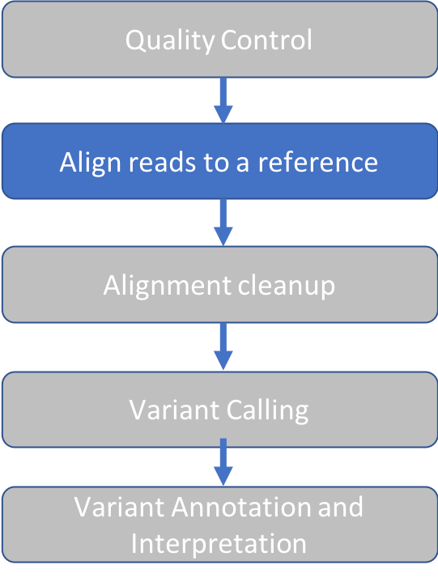
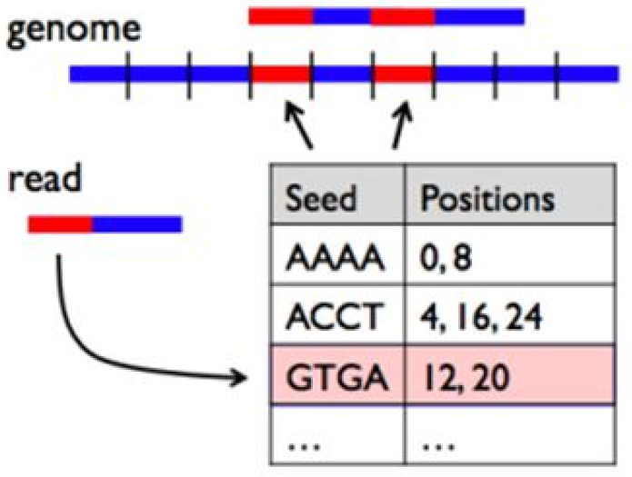
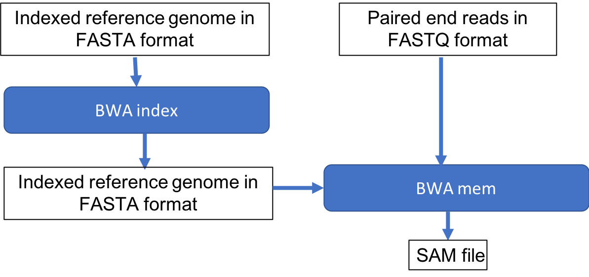

Approximate time: 20 minutes

## Goals
- Align short reads to a references genome with BWA
- View alignment using IGV



## BWA Overview

Burrows-Wheeler Aligner ([BWA](http://bio-bwa.sourceforge.net/)) is a software package for mapping low-divergent 
sequences against a large reference genome, such as the human genome. 
The naive approach to read alignment is to compare a read to every position in the reference genome until a good match 
is found is far too slow. 
BWA solves this problem by creating an "index" of our reference sequence for faster lookup.

The following figure shows a short read with a red segment followed by a blue segment that 
we seek to align to a genome containing many blue and red segments.
The table keeps track of all the locations where a given pattern of red and blue segments (seed sequence) occurs in the 
reference genome. When BWA encounters a new read, it looks up the seed sequence at the beginning of the read in the table 
and retrieves a set of positions that are potential alignment positions for that read. 
This speeds up the search by reducing the number of positions to check for a good match.



BWA has three algorithms:

- BWA-backtrack: designed for Illumina sequence reads up to 100bp (3-step)
- BWA-SW:  designed for longer sequences ranging from 70bp to 1Mbp, long-read support and split alignment
- BWA-MEM: optimized for 70-100bp Illumina reads

We'll use BWA-MEM. 
Underlying the BWA index is the [Burrows-Wheeler Transform](http://web.stanford.edu/class/cs262/presentations/lecture4.pdf)
This is beyond the scope of this course but is an widely used data compression algorithm.

## BWA Index

In the following steps we'll create the BWA index. 

1. Change to our reference data directory
`cd intro-to-ngs/ref_data`

2. Preview our genome using the command `head` by typing:

`head chr10.fa` 

You'll see the first 10 lines of the file `chr10.fa`:
```buildoutcfg
>chr10 AC:CM000672.2 gi:568336…   <-- '>' charachter followed by sequence name
NNNNNNNNNNNNNNNNNNNNN             <-- sequence
…
```
This is an example of FASTA format. FASTA format is similar to the first two lines of FASTQ format, storing only the 
sequence name and sequence.

3. Load the BWA module, which will give us access to the `bwa` program:
```
module load bwa/0.7.17
```

Test it out without any arguments in order to view the help message.
```markdown
bwa
```

Result:
```markdown
Program: bwa (alignment via Burrows-Wheeler transformation)
Version: 0.7.17-r1198-dirty
Contact: Heng Li <lh3@sanger.ac.uk>

Usage:   bwa <command> [options]

Command: index         index sequences in the FASTA format
…
```

Use the `bwa index` command to see usage instructions for genome indexing

```markdown
bwa index
```

Result
```markdown
Usage:   bwa index [options] <in.fasta>
Options: -a STR    BWT construction algorithm …
```

Run the command as instructed, using the default options:
```markdown
bwa index chr10.fa
```

Result:
```markdown
[bwa_index] Pack FASTA... 0.93 sec
[bwa_index] Construct BWT for the packed sequence...
[BWTIncCreate] textLength=267594844, availableWord=30828588
	[BWTIncConstructFromPacked] 10 iterations done. 50853228 characters processed.
[BWTIncConstructFromPacked] 20 iterations done. 93947292 characters processed.
[BWTIncConstructFromPacked] 30 iterations done. 132245372 characters processed.
[BWTIncConstructFromPacked] 40 iterations done. 166280796 characters processed.
[BWTIncConstructFromPacked] 50 iterations done. 196527516 characters processed.
[BWTIncConstructFromPacked] 60 iterations done. 223406844 characters processed.
[BWTIncConstructFromPacked] 70 iterations done. 247293244 characters processed.
[BWTIncConstructFromPacked] 80 iterations done. 267594844 characters processed.
[bwt_gen] Finished constructing BWT in 80 iterations.
[bwa_index] 59.13 seconds elapse.
[bwa_index] Update BWT... 0.67 sec
[bwa_index] Pack forward-only FASTA... 0.59 sec
[bwa_index] Construct SA from BWT and Occ... 24.98 sec
[main] Version: 0.7.17-r1198-dirty
[main] CMD: bwa index chr10.fa
[main] Real time: 87.087 sec; CPU: 86.306 sec
```

When it's done, take a look at the files produced by typing `ls`.
The following is the result, with arrows and text on the right giving an explanation of each file.

```markdown
chr10.fa      <-- Original sequence
chr10.fa.amb  <-- Location of ambiguous (non-ATGC) nucleotides
chr10.fa.ann  <-- Sequence names, lengths
chr10.fa.bwt  <-- BWT suffix array
chr10.fa.pac  <-- Binary encoded sequence
chr10.fa.sa   <-- Suffix array index
```

## BWA alignment
Let's check the usage instructions for BWA mem by typing `bwa mem`

```markdown
Usage: bwa mem [options] <idxbase> <in1.fq> [in2.fq]

Algorithm options:

       -t INT        number of threads [1]
       -k INT        minimum seed length [19]
       -w INT        band width for banded alignment [100]
       -d INT        off-diagonal X-dropoff [100]
       -r FLOAT      look for internal seeds inside a seed longer than {-k} * FLOAT [1.5]
       -y INT        seed occurrence for the 3rd round seeding [20]
       -c INT        skip seeds with more than INT occurrences [500]
       -D FLOAT      drop chains shorter than FLOAT fraction of the longest overlapping chain [0.50]
       -W INT        discard a chain if seeded bases shorter than INT [0]
       -m INT        perform at most INT rounds of mate rescues for each read [50]
       -S            skip mate rescue
       -P            skip pairing; mate rescue performed unless -S also in use
...
```

Since our alignment command will have multiple arguments, it will be convenient to write a script.

Go up one level to our main `intro-to-ngs` directory:
```markdown
cd ..
```

Make a new directory for our results
```markdown
mkdir results
```

Open a text editor with the program `nano` and create a new file called `bwa.sh`.
```markdown
nano bwa.sh
```

Enter the following text.
Note that each line ends in a single backslash `\`, which will be read as a line continuation.
Be careful to put a space *before* the backslash and *not after*.
This serves to make the script more readable.

```markdown
module load bwa/0.7.17

bwa mem \
-t 2 \
-M \
-R "@RG\tID:reads\tSM:na12878\tPL:illumina" \
-o results/na12878.sam \
ref_data/chr10.fa \
raw_data/na12878_1.fq \
raw_data/na12878_2.fq
```

Let's look line by line at the options we've given to BWA:
1. `-t 2` : BWA runs two parallel threads. Alignment is a task that is easy to parallelize 
because alignment of a read is independent of other reads. Recall that in [Setup](01_Setup.md) we asked for a compute 
node allocation with  `--cpus=4`, which can process up to 8 threads. Here we are using only 2 threads. 

2. `-M` : "mark shorter split hits as secondary". This option will change the SAM flag (discussed in next section) that 
is assigned to short reads that have read segments mapped to distant locations.
It optionn is needed for GATK/Picard compatibility, which are tools we use downstream. [see this explanation on biostars](https://www.biostars.org/p/97323/
)

3. `-R "@RG\tID:reads\tSM:na12878\tPL:illumina" `: Add a read group tag (RG), sample name (SM), and platform (PL) to our alignment file header. 
We'll see where this appears in our output. In addition to being required for GATK, it's advisable to always add these 
labels to make the origin of the reads clear.

4. `-o results/na12878.sam` :  Place the output in the results folder and give it a name

5. The following arguments are our reference, read1 and read2 files, in the order required by BWA:
``` 
ref_data/chr10.fa \
raw_data/na12878_1.fq \
raw_data/na12878_2.fq
```

Exit nano by typing `^X` and follow prompts to save and name the file `bwa.sh`.

Now we can run our script.
```markdown
sh bwa.sh
```

Result:
```markdown
[M::bwa_idx_load_from_disk] read 0 ALT contigs
[M::process] read 9304 sequences (707104 bp)...
[M::mem_pestat] # candidate unique pairs for (FF, FR, RF, RR): (0, 2256, 0, 0)
[M::mem_pestat] skip orientation FF as there are not enough pairs
[M::mem_pestat] analyzing insert size distribution for orientation FR...
[M::mem_pestat] (25, 50, 75) percentile: (120, 160, 216)
[M::mem_pestat] low and high boundaries for computing mean and std.dev: (1, 408)
[M::mem_pestat] mean and std.dev: (172.35, 67.15)
[M::mem_pestat] low and high boundaries for proper pairs: (1, 504)
[M::mem_pestat] skip orientation RF as there are not enough pairs
[M::mem_pestat] skip orientation RR as there are not enough pairs
[M::mem_process_seqs] Processed 9304 reads in 1.034 CPU sec, 0.518 real sec
```

List the files in the results directory by typing `ls results`.
Result:
```markdown
na12878.sam
```
---
## Sequence Alignment Map (SAM)

Take a look at the output file:
```markdown
cd results
head na12878.sam
```
The file has two sections

Header:
```markdown
@SQ     SN:chr10        LN:133797422        <-- Reference sequence name (SN) and length (LN)
@RG     ID:reads        SM:na12878          <-- Read group (ID) and sample (SM) information that we provided
@PG ID:bwa PN:bwa VN:0.7.17… CL:bwa mem     <-- Programs and arguments used in processing
```

Alignment:

1 | 2 | 3 | 4 | 5 | 6 | 7 | 8 | 9 | 10 | 11 | 
------|------|-----|----|------|------|-----|----|------|-----|---- 
SRR098401.109756285 |83 | chr10 |94760653 |60 |76M | = | 94760647 | -82 | CTAA… | D?@A... |
SRR098401.109756285 | 163 | chr10 | 94760647 | 60 | 76M | = 94760653  | 82 | ATTA…   |  ?>@@... | 

The fields:
1. Read ID
2. Flag: indicates alignment information e.g. paired, aligned, etc.
Here is a useful site to [decode flags](https://broadinstitute.github.io/picard/explain-flags.html).
3. Reference sequence name
4. Position on the reference sequence where mapping starts
5. Mapping Quality
6. CIGAR string: summary of alignment, e.g. match (M), insertion (I), deletion (D)
7. RNEXT: Name of reference sequence where the other read in the pair aligns
8. PNEXT: Position in the reference sequence where the other read in the pair aligns
9. TLEN: Template length, size of the original DNA or RNA fragment
10. Read Sequence
11. Read Quality

More information on [SAM format](https://samtools.github.io/hts-specs/SAMv1.pdf).

---
## Alignment Quality Control

Next, we'd like to know how well our reads aligned to the reference genome?
We'll use a tool called `Samtools` to summarize the SAM Flags.

To load the module:
```markdown
module load samtools/1.9
```

To run the `flagstat` program on our `SAM` file:
```
samtools flagstat na12878.sam
```

Result:
```markdown
9306 + 0 in total (QC-passed reads + QC-failed reads)        <-- We have only QC pass reads
2 + 0 secondary                                              <-- 2 reads have >1 alignment position 
0 + 0 supplementary                                          <-- for reads that align to multiple chromosomes
0 + 0 duplicates                                             
9271 + 0 mapped (99.62% : N/A)                               <-- For exome data, >90% alignment is expected    
9304 + 0 paired in sequencing
4652 + 0 read1
4652 + 0 read2
9226 + 0 properly paired (99.16% : N/A)
9240 + 0 with itself and mate mapped
29 + 0 singletons (0.31% : N/A)
0 + 0 with mate mapped to a different chr
0 + 0 with mate mapped to a different chr (mapQ>=5)
```

Samtools flagstat is a great way to check to make sure that the aligment meets the quality expected.
In this case, >99% properly paired and mapped indicates a high quality alignment.

## Summary



[Next: Alignment Cleanup](04_Alignment_Cleanup.md) 

[Previous: Quality Control](02_Quality_Control.md)

[Main Page](../README.md)
