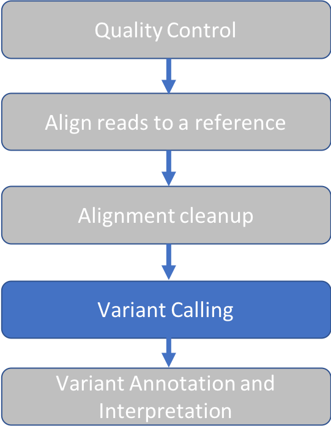
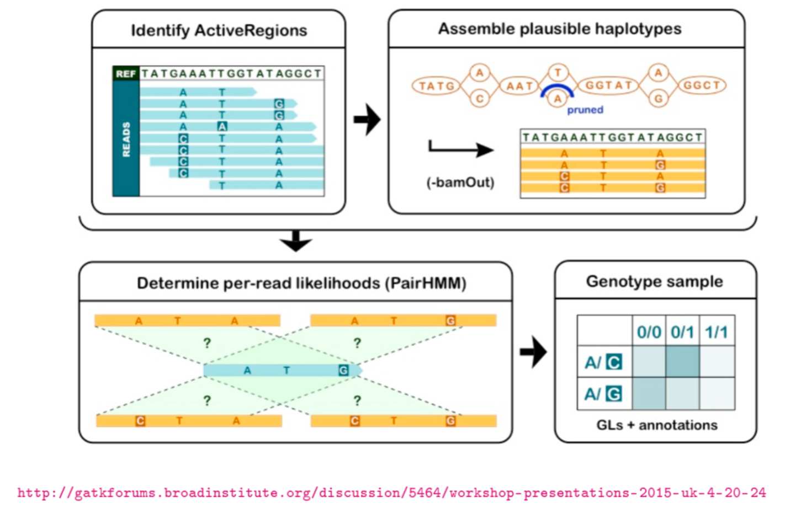
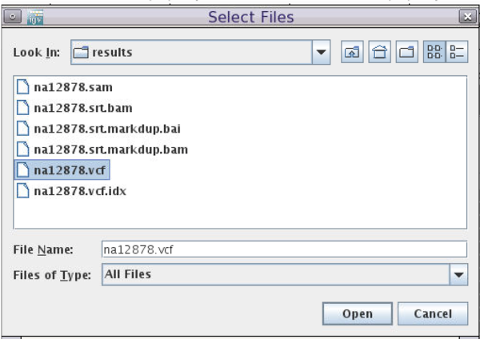

Approximate time: 20 minutes

## Learning Objectives

Use Genome Analysis Tool Kit (GATK) to call variants



## Prepare the reference sequence for GATK

GATK requires a Sequence Dictionary for reference genomes used in variant calling.
The sequence dictionary contains names and lengths of all chromosomes in the reference genome.
The information in this file is transferred to the Variant Call File (VCF) when it is produced, so that there is no
ambiguity about which reference was used to produce the file.

Let's open a new script
```markdown
nano prepare.sh
```

Add these lines:
```markdown
module load samtools/1.9
module load picard/2.8.0

samtools faidx ref_data/chr10.fa

picard CreateSequenceDictionary \
REFERENCE=ref_data/chr10.fa \
OUTPUT=ref_data/chr10.dict
```

With these steps, we load the necessary modules, created a FASTA index for our reference sequence, and use Picard to
create our Sequence Dictionary.

Run our script:
```
sh prepare.sh
```

Result:
```
[Fri May 08 16:52:35 EDT 2020] picard.sam.CreateSequenceDictionary REFERENCE=ref_data/chr10.fa OUTPUT=ref_data/chr10.dict    TRUNCATE_NAMES_AT_WHITESPACE=true NUM_SEQUENCES=2147483647 VERBOSITY=INFO QUIET=false VALIDATION_STRINGENCY=STRICT COMPRESSION_LEVEL=5 MAX_RECORDS_IN_RAM=500000 CREATE_INDEX=false CREATE_MD5_FILE=false GA4GH_CLIENT_SECRETS=client_secrets.json
[Fri May 08 16:52:35 EDT 2020] Executing as rbator01@pcomp31 on Linux 2.6.32-696.1.1.el6.x86_64 amd64; Java HotSpot(TM) 64-Bit Server VM 1.8.0_60-b27; Picard version: 2.8.0-SNAPSHOT
[Fri May 08 16:52:35 EDT 2020] picard.sam.CreateSequenceDictionary done. Elapsed time: 0.01 minutes.
Runtime.totalMemory()=2058354688
```

Two new files are created in the folder `ref_data`, our FASTA index (fai) and sequence dictionary (dict):
```markdown
chr10.fa.fai
chr10.dict
```

## Variant Calling with GATK HaplotypeCaller

GATK has two main goals:
- Separate true variants from sequencing error
- Establish which variants co-exist on a single DNA strand (haplotype)

The figure below described the 4 stages of the GATK HaplotypeCaller algorithm (from [software.broadinstitute.org](https://gatkforums.broadinstitute.org/gatk/discussion/11068/haplotypecaller-in-a-nutshell)
).



Paraphrasing from the GATK documentation, the four stages are as follows:

1. Define active regions. The program determines which regions of the genome it needs to operate on,
based on the presence of significant evidence for variation.

2. Determine haplotypes by re-assembly of the active region.
For each active region, the program builds a graph to represent all possible read sequences spanning the region.
For example, the top first read starts in the `TATG` bubble that is common to all reads, then takes the top path to the `A` bubble,
continues through the `AAT`, etc.
The program then realigns each haplotype (path through the graph) against the reference sequence in order to identify
potentially variant sites.

3. Determine likelihoods of the haplotypes given the read data.
The goal of this stage is to evaluate which haplotypes have the most read support.
For each active region, the program performs a pairwise alignment of each read against each haplotype using the PairHMM algorithm,
which takes into account other information about the data, such as quality scores.
This produces a matrix of likelihoods of haplotypes given the read data.
These likelihoods are then used to calculate how much evidence there is for individual alleles at each variant site (marginalization over alleles).

4. Assign sample genotypes.
The final step is to determine which sequences were most likely present in the data.
This step uses Bayes' rule to find the most likely genotype, given the allele likelihoods calculated in the last step.

## Run GATK on our BAM file
To load the module on our system, we'll type:

```markdown
module load GATK/3.7
```
We can check the usage for GATK, which has many tools in addition to HaplotypeCaller:
```markdown
gatk --help
```

The result shows the many different tools inside GATK. The relevant lines for HaplotypeCaller are:
```markdown
…
usage: java -jar GenomeAnalysisTK.jar -T <analysis_type> …
…
 haplotypecaller                 
   HaplotypeCaller               Call germline SNPs and indels via local re-assembly of haplotypes
   HaplotypeResolver             Haplotype-based resolution of variants in separate callsets.
```

For tool specific help, we type:
```markdown
gatk -T HaplotypeCaller --help
```

Let's write a new script:
```markdown
nano gatk.sh
```

Add these lines, which specify the reference file, input BAM, and output VCF.
```markdown
module load GATK/3.7

gatk -T HaplotypeCaller \
-R ref_data/chr10.fa \
-I results/na12878.srt.markdup.bam \
-o results/na12878.vcf
```

Run our script:
```markdown
sh gatk.sh
```

Result:
```markdown
INFO  17:17:41,656 HelpFormatter - -----------
INFO  17:17:41,660 HelpFormatter - The Genome Analysis Toolkit (GATK) v3.7-0-gcfedb67, Compiled 2016/12/12 11:21:18 
…
```

Two new files have appeared in our results folder, the variant call file (VCF) and index file, respectively:
```markdown
na12878.vcf 
na12878.vcf.idx
```

## VCF format

We can take a look at the first few lines of our vcf file:
```markdown
cd results
head na12878.vcf
```

VCF, like BAM files, files contain two sections: A header section, indicated by the presence of `#` at the beginning of the line,
followed by data lines for each variant that was called.
```markdown
##fileformat=VCFv4.2
##FILTER=<ID=LowQual,Description="Low quality">
##FORMAT=<ID=AD,Number=R,Type=Integer,Description="Allelic depths for the ref and alt alleles in the order listed">
##FORMAT=<ID=DP,Number=1,Type=Integer,Description="Approximate read depth …
##FORMAT=<ID=GQ,Number=1,Type=Integer,Description="Genotype Quality">
##FORMAT=<ID=GT,Number=1,Type=String,Description="Genotype">
##FORMAT=<ID=PL,Number=G,Type=Integer,Description="Normalized, Phred-scaled likelihoods for genotypes …
##GATKCommandLine.HaplotypeCaller=<ID=HaplotypeCaller,...
….
##contig=<ID=chr10,length=135534747>
##reference=file:///cluster/home/tutln01/intro-to-ngs/ref_data/chr10.fa
#CHROM	POS	ID	REF	ALT	QUAL	FILTER	INFO	        FORMAT	    NA12878
chr10	96521422	.	A	G	60.28	.         AC=2;AF=1.00; ….  GT:AD:DP:GQ:PL  1/1:0,3:3:9:88,9,0
chr10	96522365	.	T	C	1134.77	.         AC=1;AF=0.500;….  GT:AD:DP:GQ:PL  0/1:47,37:84:99:1163,0,1502
```

The header lines explain the meaning of notation found in the body section of the VCF, as well as information about the
reference and software used to produce the VCF.
The last header line lists the column titles for information, and the last column has the sample name.
VCF can be used to represent multiple samples, and in that case, each sample would have it's own subsequent column.

Let's look at the body section in table format:

| CHROM | POS | ID | REF | ALT | QUAL | FILTER | INFO | FORMAT | NA12878 |
|:---:|:---:|:---:|:---:|:---:|:---:|:---:|:---:|:---:|:---:|
| chr10 | 96521422 | . | A | G | 60.28 | . | AC=2;AF=1.00; …. | GT:AD:DP:GQ:PL | 1/1:0,3:3:9:88,9,0 |

Fixed fields (same for all samples in the VCF)
CHROM - Chromosome
POS - Position
ID - Identifier. May be present if the VCF was annotated with known variants, for example, rs numbers from dbSNP.
REF - Reference sequence base
ALT - Alternate base, comma separated list of non-reference alleles (usually) found in the samples represented by the VCF
QUAL - Phred scaled quality score for the variant, i.e. $10log_{10}$ prob(call is wrong).
FILTER - PASS if this position has passed all filters, otherwise the name of the filter islisted.
INFO - Additional information

Genotype fields (one per sample):
FORMAT - This field specifies the format that will be used to give information in each sample column.
VCF can represent In this case, we see `GT:AD:DP:GQ:PL`, which corresponds to the values `1/1:0,3:3:9:88,9,0`.
GT - Genotype, encoded as allele values separated by either '/' (unphaseD) or '|' (phased - known to be on the same chromosome arm). The allele values are 0 for the reference allele
and 1 for the first allele listed.
AD - Allele depth at this position for the same, reference first followed by first allele listed
DP - Read depth at this position for the sample
GQ - Genotype quality
PL - Genotype liklihoods

For more on the rich VCF format, see [the VCF format specification from Samtools](https://samtools.github.io/hts-specs/VCFv4.2.pdf)

## VCF Quality Control

It's always a good idea when writing a new pipeline, to ask: How well did our variant calling perform?
In this case, the best way to check the performance would be to compare the variants we called in this exercise matched the "known" variants for
NA12878 in the [NIST callset](https://github.com/ga4gh/benchmarking-tools/blob/master/resources/high-confidence-sets/giab.md
). That exercise is beyond the scope of this workshop.

## Add our VCF to IGV

We can add a VCF track to our IGV windows.

1. Go to back to IGV on demand
2. Click the `File` menu and select `Load from File`
3. Select the file `na12878.vcf`



3. We'll see a variant track appear above the coverage track.
Hover over the colored blocks on the variant track in order to see the information in the VCF.


## Summary


[Next: Variant Annotation](06_Variant_Annotation.md)

[Previous: Alignment Cleanup](04_Alignment_Cleanup.md)

[Main Page](../README.md)
