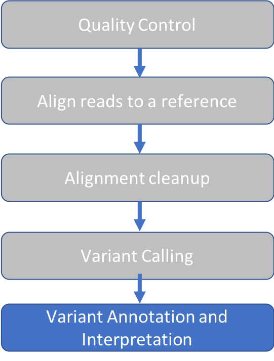
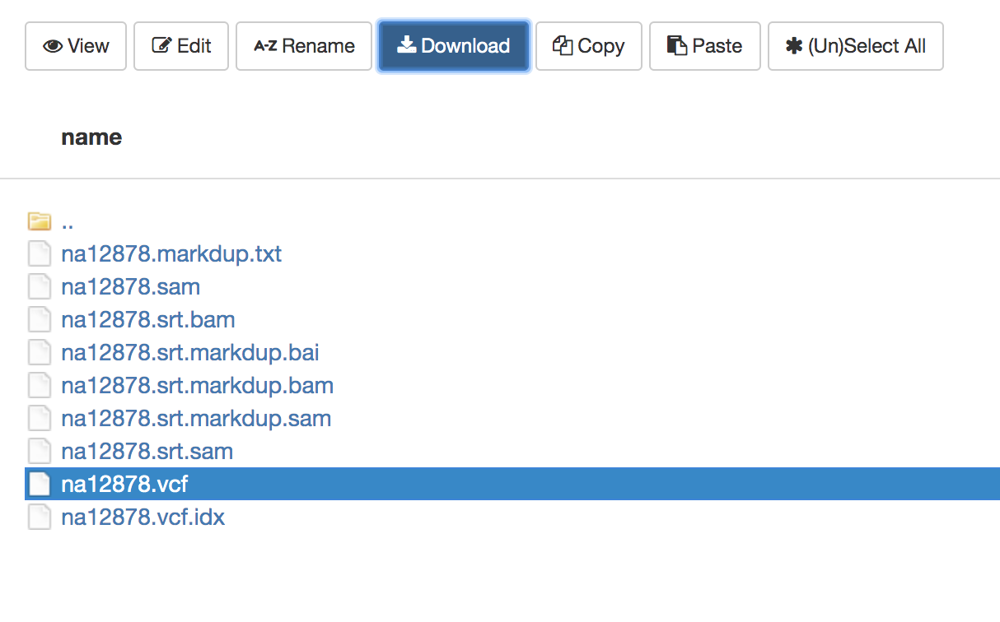
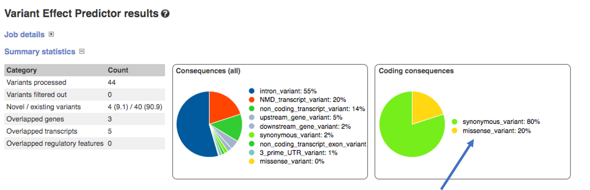
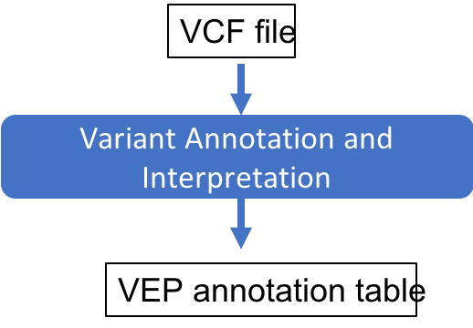

Approximate time: 20 minutes

## Learning Objectives

- Use the Variant Effect Predictor (VEP) online web server to annotate variants  
- Identify amino acid changing substitutions in our VCF

## VEP overview
VEP will add annotation from a number of sources for each variant that we upload.
Below is a subset of the most commonly used annotations annotations.

- Identifiers: Gene, transcript, protein, etc.

- Frequency data: Allele frequency information from multiple public databases.
[1000 Genomes](https://www.internationalgenome.org/data/),
(gnomAD)[https://gnomad.broadinstitute.org/],
(ESP)[https://evs.gs.washington.edu/EVS/]
 Allele frequency information is helpful to understand whether the input variant is common or rare in different geographical populations.

-Pathogenicity predictions:
Computational predictions of whether a variant will affect the protein function.
Various algorithms are available ([SIFT](https://sift.bii.a-star.edu.sg/),
[PolyPhen2](http://genetics.bwh.harvard.edu/pph2/),
[CADD](https://cadd.gs.washington.edu/), etc)

- Disease Association:
Clinical significance and disease association as reported in [ClinVar](https://www.ncbi.nlm.nih.gov/clinvar/).
ClinVar is a widely used database that aggregates and curates clinical reports of variants with clinical determinations.
The clinical significances reported in VEP range from `Benign` to `Pathogenic` and usually have a disease annotation.

- Consequence:
For each variant, VEP identifies all transcripts in the selected database (Ensembl or Refseq) that overlaps with the variant coordinates.
The consequence of the variant with respect to the transcript is then evaluated based on the following diagram.

These consequences are then binned into impact groups: LOW, MODERATE, MODIFIER, HIGH.
For a full mapping to consequence to impact, see [VEP](https://m.ensembl.org/info/genome/variation/prediction/predicted_data.html)

We'll run VEP on the VCF that we produced and analyze the variant consequences.

## Download the VCF
First, we'll download the VCF from the cluster to our local computer.

1. Go back to [https://ondemand.cluster.tufts.edu](https://ondemand.cluster.tufts.edu)
2. In the top grey menu, click `Files` and select `Home Directory`.

3. Select `intro-to-ngs/results/na12878.vcf`

4. Click `Download`

## Run VEP

1. In web browser tab, navigate to to [https://useast.ensembl.org/Tools/VEP](https://useast.ensembl.org/Tools/VEP)
Note that VEP can also be run on the command line on our HPC, resulting in a text file (txt or vcf).
You are welcome to ask for instructions to run the command line VEP.
For single VCF analysis, the web server is recommended in order to take advantage of the visualization tools.

2. In the `Species` section choose `Human (Homo sapiens)` (should be the default)

3. In the `Input data` section choose `Or upload file:` and navigate to the downloaded file `na12878.vcf`

3. Under `Transcript database to use` select `RefSeq transcripts`

4. Click `Run`

### Viewing VEP results
When your job is done, click `View Results`

Our goal is to identify variants that change the coding sequence.
We can see in the `Coding Consequences` box on the right that 20% of the variants are `missense`, which means that they
change the coding sequence of the transcript.

### Filtering VEP consequences
Under `Filters` choose `Consequence` + `is` + `missense_variant` and click `Add`
You should see 1 row - here are a subset of interesting columns:

|Location | Allele | Consequence | IMPACT | SYMBOL | BIOTYPE | Amino_acids |
|:---:|:---:|:---:|:---:|:---:|:---:|:---:|
|10:94842866-94842866 | G | missense_variant | MODERATE | CYP2C19 | protein_coding | I/V |

| Existing_variation | SIFT | PolyPhen | AF | Clinical Significance |
|:---:|:---:|:---:|:---:|
| rs3758581,CM983294 | tolerated(0.38) | benign(0.05) | 0.9515 | |

Based on the annotations, one can conclude that this variant unlikely to cause disease.
This is consistent with what we know about `NA12878` being a healthy individual.

Though the vatiant does change the amino acid from `I` to `V`, both SIFT, PolyPhen both suggest that this change does not
alter protein function.
Furthermore, there is no ClinVar report associated with this variant.
Finally, the maximum allele frequency found for this variant in the `1000 Genomes` database is `0.95`, meaning it is a
very common variant and unlikely to be pathogenic.

## summary

[Previous: Variant Calling](05_Variant_Calling.md)
                                             
[Main Page](../README.md)
