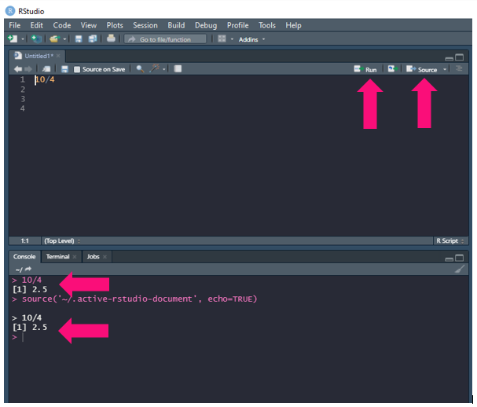
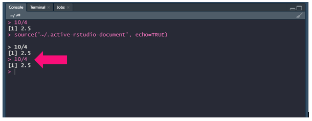
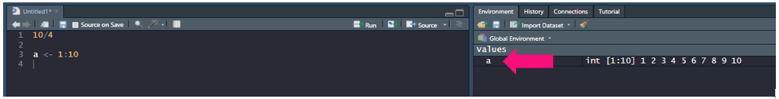
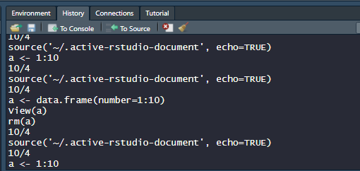
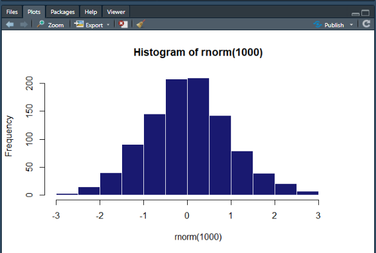
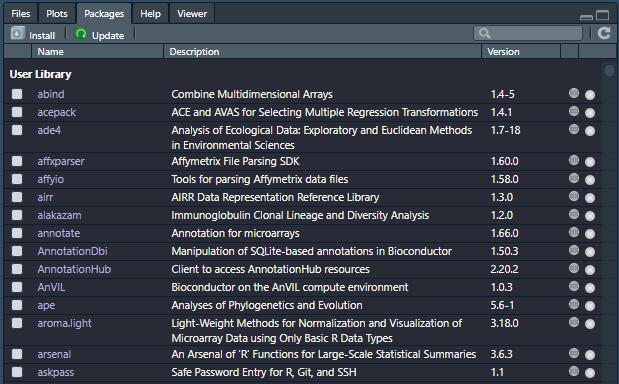
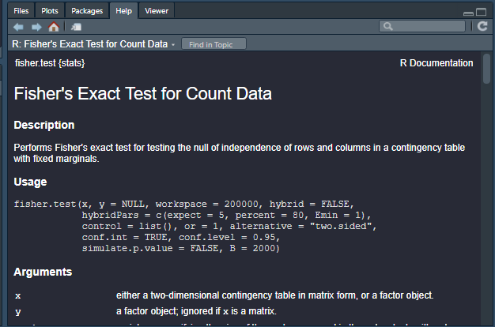

# R and RStudio

If you don't already have R installed on your computer you can install it at [The R Project for Statistical Computing](https://www.r-project.org/). Now once you have R installed on your machine you'll need a way to create code with it. While you can do so from command line, most people prefer to use RStudio to do so. RStudio is a type of IDE, or integrated development environment. It provides a number of tools that make coding much easier and can be downloaded at [Download the RStudio IDE](https://www.rstudio.com/products/rstudio/download/).

## Taking a Look Around

When you open up RStudio it will look something like this:


We see that there is a:

* script editor to write scripts
* enivronment/history tab to inspect available variables/history
* console to run R code without a script
* section to view your files, plots, packages, and help information

## The Script Editor

Let's demonstrate how to use this! Say you want to divide 10 by 4. We can do that in our script editor:



In the script we write out ```10/4```. We can either run the whole script or just one line if we are testing something. To test one line:

* Ensure the cursor is on that one line
* Hit ```Ctrl``` and ```Enter``` 

OR

* Hit ```Run``` at the top of the script editor

If you want to run the whole script you'll need to source it. To do so all you need to do is Hit ```Source``` at the top of the screen. To save this script you can either go to ```File``` > ```Save``` or you can just hit ```Ctrl``` and ```S```.

## Console

If we were so inclined we could skip writing a script all together and just use the console. All we need to do is write out ```10/4``` in the console and hit ```Enter```:



## Environment/History Window

Now say we were to create a variable (Don't worry in the next workshop we will go over this in more detail). We can get a snapshot of what it contains in the Environment window:



If we would like to see the history of our past code, we can do so by clicking over to the History tab:



## Files/Plots/Packages/Help

The last window pane will allow you to peruse your files:


Examine your plots:



View what packages you have installed:



And help you determine what a certain function does:



> NOTE: to get the help window to populate with information you will need to type ```?``` before the function you are examining in the console. So using the function above as an example, you'd type ```?fisher.test``` into the console hit ```Enter``` and helpful information will populate in the ```Help``` window.

_________________________________________________________________________________________________________________________________________________________________________________

Next Workshop: [Sytax/Data Structures](../Syntax_DataStructures/Syntax_DataStructures.md)

[Back To Introduction to R](../IntroToR.md)

[Back To The Main Page](../../index.md)
