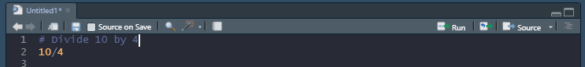
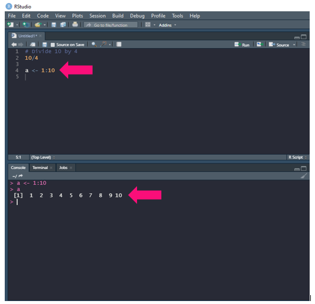
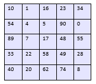
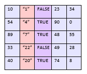

# Syntax and Data Structures

## Syntax

Now that we are familiar with how to use Rstudio, let's get into R syntax, which can be broken down into:

* Comments 
* Variables/Assignment Operator
  *  Data Structures
* Functions

## Comments

In R, comments begin with a ```#``` and are not read as code. We can write what ever we want after the ```#``` and we usually do so to clarify what we are doing in our code. As an example:



## Variables/Assignment Operator

Variables are essentially names that hold information for us and we can assign that information to a name with the assignment operator: ```<-```. Take this for example:



Here we assign ```1 2 3 4 5 6 7 8 9 10``` to the letter ```a```. And when we type a into the console we can see what ```a``` was storing. Cool right? However, we are not limited to just numbers we can store:

* ```numeric``` - as we just discussed numeric values are whole numbers and decimals
* ```character``` - text value that is made a text value by adding quotes. So for example ```1 2 3``` is a numeric data, but ```"1" "2" "3"``` is character data
* ```integer``` - limited to just whole numbers, but will take up less memory than numeric data
* ```logical``` - These are boolean values so ```TRUE```/```T``` or ```FALSE```/```F```.
* ```complex``` - complex number such as ```1+6i```

## Data Structures

So we have all this lovely data to play with and in R we typically organize in a few ways:

### Vectors

Vectors are collections of data, like a:

  collection of numbers - ```c(1,2,3)```
  collection of characters -  ```c("1","2","3")```
  collection of logical values - ```c(TRUE,FALSE,TRUE)```

It should be noted that a vector needs to be a collection of the **same type** of data. You will also note that each list is separated by commas and surrounded by ```c()```. This is necessary to create vectors so make sure to remember the ```c()```!

### Factors

Factors can be used to store categorical data and can be created like this:

  ```size <- c("small", "medium", "small", "large", "medium")```
  
  ```size <- factor(size)```
  
Now we have turned this character vector into a factor vector! These will come in handy when we start breaking down data by category.

### Matrices

A matrix can be created by combining vectors of the **same length and same data type**. They are used frequently when performing operations on numeric data but can include other data types. They will usually look something like this:



### Data Frames

Data frames are also collections of vectors of the **same length**. However, they do not need to be the same data type:



### Lists

Lists are collections of data that **do not** need to be the same type or length. Here is an example:

```
$numbers
 [1]  1  2  3  4  5  6  7  8  9 10

$characters
[1] "a" "b" "c"

$dataframe
  num1 X6.10
1    1     6
2    2     7
3    3     8
4    4     9
5    5    10
```

## Functions

Functions are operations we can perform on our various data structures to get some result. We typically like to make functions modular so they perform one specific task and not whole pipelines. Here is the general format for a function:

```
functionName <- function(x){
  result <- operation(x)
  return(result)
}
```

So here we see that we assign some operation to a name, here it we just call it ```functionName```. Then the function takes an input, ```x```. Inside the function our result is obtained by doing some operation on our input. Finally we then use ```return()``` to return that result. Let's try making a function that will square the input:

```
squareInput <- function(x){
  result <- x * x
  return(result)
}

squareInput(5)
> 25
```

## References

1. [HBC Training](https://hbctraining.github.io/Intro-to-R-flipped/schedules/links-to-lessons.html)


_________________________________________________________________________________________________________________________________________________________________________________

Next Workshop: [Importing Data](../ImportingData/ImportingData.md)

[Back To Introduction to R](../IntroToR.md)

[Back To The Main Page](../../index.md)
