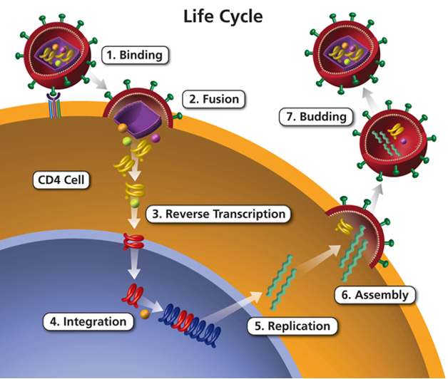
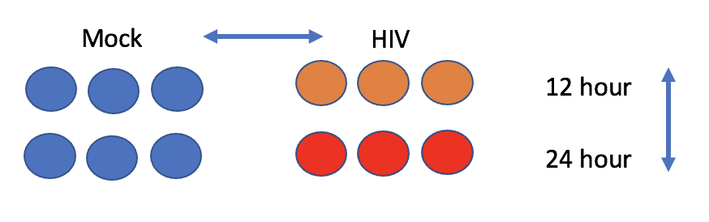
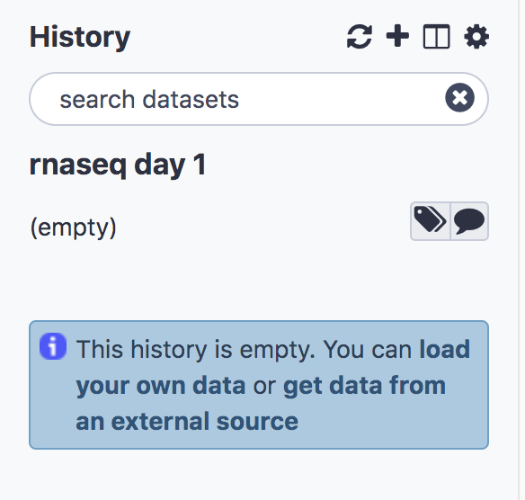
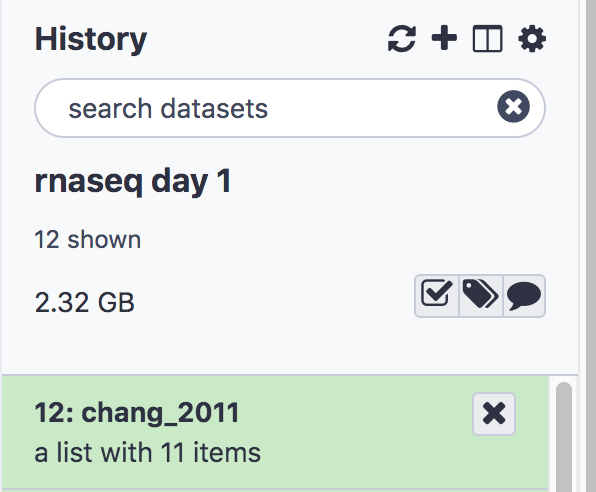

# Intro to RNA-Seq using Tufts Galaxy 


The introductory [Slides](../slides/slides_workshop_12Apr21.pdf) give an overview of RNAseqencing technologies and our workflow.

## Dataset
Our dataset is from the publication:

Chang et al. **Next-Generation Sequencing Reveals HIV-1-Mediated Suppression of T Cell Activation and RNA Processing and Regulation of Noncoding RNA Expression in a CD4+T Cell Line.** mBio 2011doi: 10.1128/mBio.00134-11

HIV infects CD4+ T cells, the same cells which are critical to mounting an immune response to the virus infection.  

 

[Image Source](https://aidsinfo.nih.gov/understanding-hiv-aids/glossary/1596/life-cycle)

The experiment aims to compare the mRNA produced by Mock and HIV infected CD4+ T cells, both 12 hr and 24 hr after infection.

 

The raw reads from the study have been downsampled to 1 million reads per file in order to speed up computation. The full dataset is available from NCBI under accession [SRP013224](https://www.ncbi.nlm.nih.gov/sra?term=SRP013224).

The following steps will walk you through how to run the tools. In each step certain parameters are set. If a parameter option appears on the screen but this tutorial doesn't mention how to set it, leave it at the default. There are questions throughout, which serve to guide you through the results and check your understanding.


## Create a new history
- Click the **+** at the top of the history panel
- To rename the history, click on the box **Unnamed History** and type **rnaseq day 1** and press enter



## Import the raw data from a shared data library on our server
- On the top menu bar, click **Shared Data** and select **Data Libraries**
- Select **chang_2011_2rep**
- Just under the top menu bar, next to the search bar, click **Export to History** and select **As a Collection**. You'll see a list of fastq files.
- Click **Continue** to add all files as a list to our current history (No need to click on individual files)
- Name the collection **chang_2011**
- Click **Create list**
- Click on **Galaxy Tufts** on the top left to go back to the main panel.

You’ll see the collection (or list) **chang_2011** in your history. 




## View Fastq files
- Click on the list **chang_2011** to expand, you’ll see 11 sequencing files with extension **fastq.qz**
- Click on the **eye icon**  on the first sequence file **HIV_12hr_rep1** and look at the fastq reads

The first 4 lines constitute the first sequencing read:
```
@SRR497699.30343179.1 HWI-EAS39X_10175_FC61MK0_4_117_4812_10346 length=75
CAGATGGCCGCAGAGGAAGCCATGAAGGCCCTGCATGGGGAGATCGGAAGAGCGGTTCAGCAGGAATGCCGAGAC
+
IIIIGIIHFIIIIBIIDII>IIDHIIHDIIIGIFIIEIGIBDDEFIG<EIEGEEG;<DB@A8CC7<><C@BBDDB
```

1. Sequence identifier
2. Sequence
3. + (optionally lists the sequence identifier again)
4. Quality string

[Next: Process Raw Reads](02_Process_raw_reads.md)

[Previous: Introduction to Galaxy](00_Galaxy_introduction.md)
