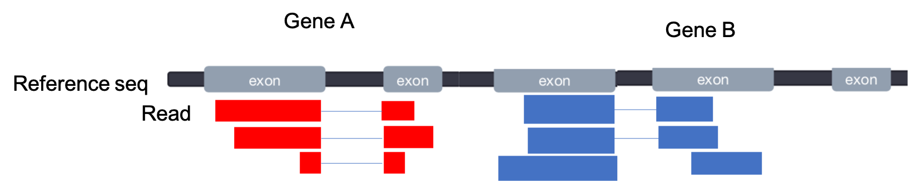
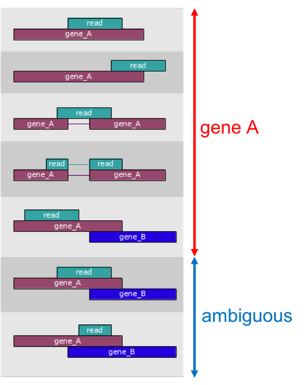
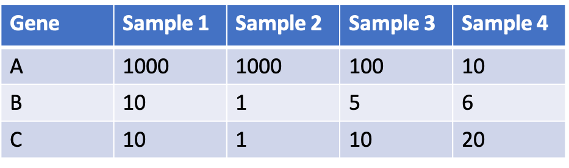

# Gene Quantification

## Counting reads for each gene
Our next step is to quantify the spliced reads that aligned to each gene in our GTF file
For two non-overlapping, multiple-exon genes, our alignment may look like this:

The tool featureCounts is part of the subRead package.
- The mapped coordinates of each read are compared with the features in the GTF file
- Reads that overlap with a gene by >=1 bp are counted as belonging to that feature 
- In default mode, ambiguous reads will be discarded

[Source](http://subread.sourceforge.net/)

The result is a gene count matrix:

## Running featureCounts
- In the **Tools** panel search bar, type **featureCounts**
- Select **featureCounts** under **RNA-seq**
- Under **Alignment file** click the  and select the bam collection generated by **STAR**
- Under **Gene annotation file** select **in your history**
- Select **hg38_genes.gtf**
- Click **Execute**
- The result will be two collections: Summary and Counts
- View the Counts file for a sample by clicking the collection and clicking the 
- Run **MultiQC** on the **Summary** collection (similar to previous steps, except selecting the appropriate tool (featureCounts) and input folder (featureCounts Summary)).

<b> Question 8: Locate the "featureCounts:Assignment" plot, which shows whether reads were assigned to genes (features) or whether they failed to be assigned. What is the main reason for reads not being "Assigned"?</b>

 

[Next: Differential Expression](05_Diff_expression.md)

[Previous: Read Alignment](03_Read_alignment.md)

[Main Page](../README.md)
