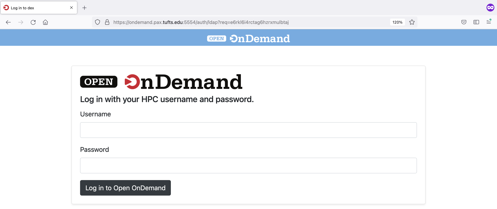
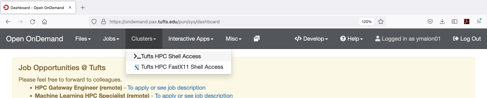
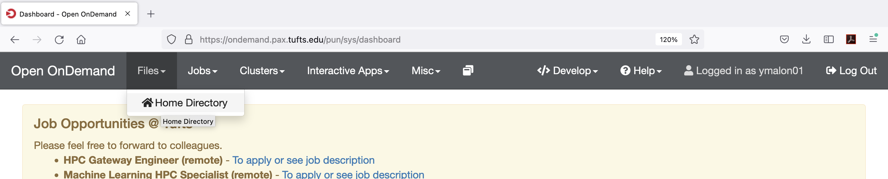
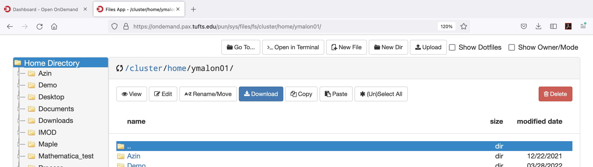
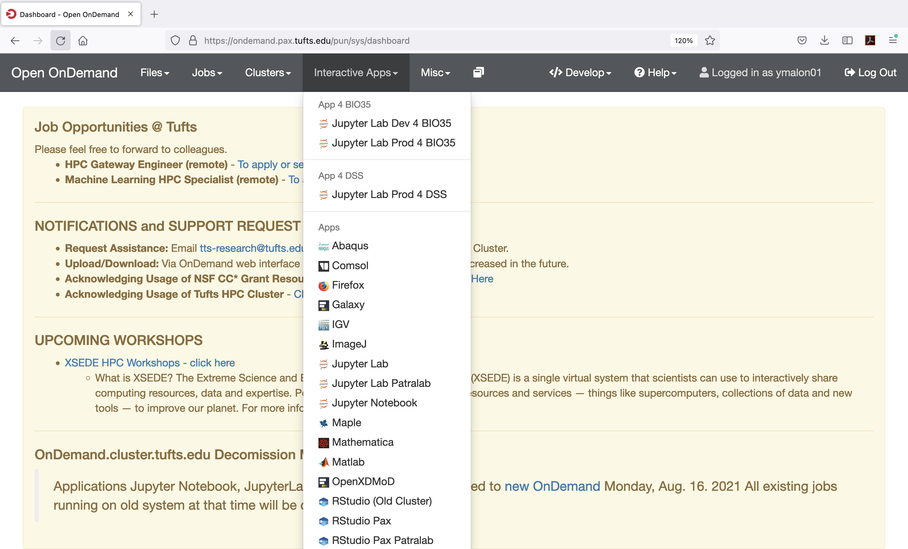

### How to Login to Tufts HPC Cluster

---
> **VPN**
>
> - Non-Tufts Network please connect to [Tufts VPN](https://access.tufts.edu/vpn)

> __2FA__
>
> * Tufts Network (not needed for [**OnDemand**](https://ondemand.pax.tufts.edu))
> * FastX11 from  [__old OnDemand__](https://ondemand.cluster.tufts.edu)

> **SSH**
>
> - The SSH protocol aka **Secure Shell** is a method for secure remote login from one computer to another. 

> **X Window System (X11)**
>
> - The X Window System (X11) is an open source, cross platform,  client-server computer software system that provides a **GUI** in a  distributed network environment.

> **Login Info**
>
> - login.cluster.tufts.edu
>
---
### **Terminal** 

  - Shell environment (default: bash):

    `$ ssh your_utln@login.cluster.tufts.edu`

    With GUI (Graphical User Interface):

    `$ ssh -XC your_utln@login.cluster.tufts.edu`

    or

    `$ ssh -YC your_utln@login.cluster.tufts.edu`

    X Window System need to be locally installed.

    Now you are on a **Login Node** of the cluster (login-prod-0x) and in your **Home Directory** (~). 
    
    `$ [your_utln@login-prod-03 ~]`

  * Setting up [SSH keyless access](_https://www.tecmint.com/ssh-passwordless-login-using-ssh-keygen-in-5-easy-steps/_)

### OnDemand Web Interface
#### [**https://ondemand.pax.tufts.edu**](https://ondemand.pax.tufts.edu)

Use your **Tufts UTLN** and **password** to login. 

__`Clusters`__, you can start a shell access to the HPC cluster. 

**`Tufts HPC Shell Access`** = `$ ssh your_utln@login.cluster.tufts.edu`

OR

Use the `>_Open in Terminal` button in `Files` to open a terminal in whichever directory you navigated to.

If you need **X11** access through OnDemand to display any GUI applications, please temporarily use our **Old OnDemand** [https://ondemand.cluster.tufts.edu](https://ondemand.cluster.tufts.edu) **`Clusters`** for this option:

**`Tufts HPC FastX11 Shell Access`** = `$ ssh -XC your_utln@login.cluster.tufts.edu` (with X11 for GUI applications)

OR 

You also have the option to use the `Xfce Terminal` under new  [OnDemand](https://ondemand.pax.tufts.edu) `Interactive Apps`.

### **Windows**
- **[PowerShell](https://docs.microsoft.com/en-us/powershell/scripting/learn/remoting/ssh-remoting-in-powershell-core?view=powershell-7.2)**
- **[Windows Subsystem for Linux (WSL)](https://docs.microsoft.com/en-us/windows/wsl/about)**
- **[PuTTY](https://www.putty.org/)**     
- **[Cygwin](https://www.cygwin.com/)**  

---

NEXT - [File Transfer](File_Transfer.md)
