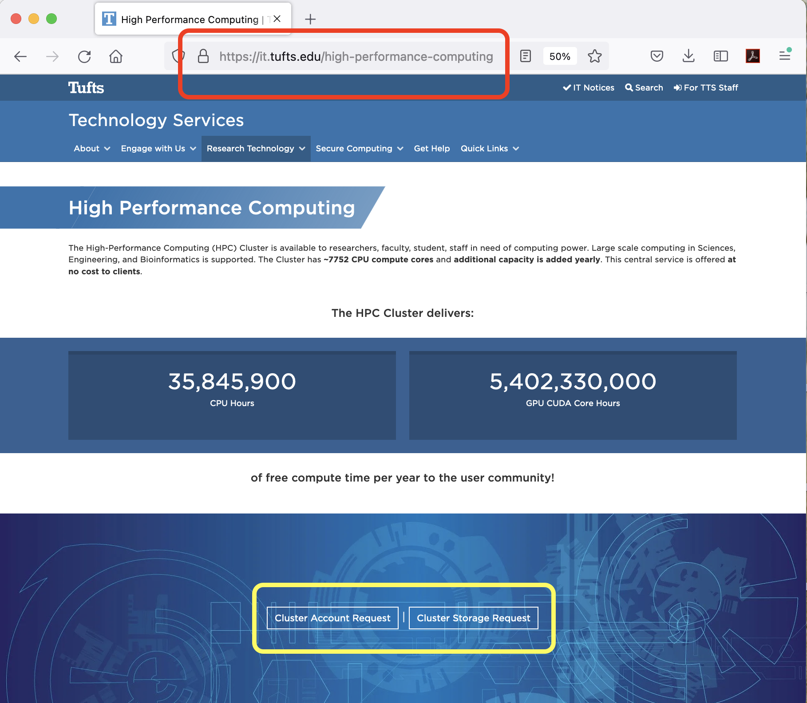

### Home Directory

Your Home Directory (10GB, fixed) should be `/cluster/home/your_utln`

### Reserach Project Storage

**Cluster Storage Request** [https://it.tufts.edu/research-technology/](https://it.tufts.edu/high-performance-computing)

Your research projet storage (from 50GB and up) path should be `/cluster/tufts/yourlabname/`, and each member of the lab group has a dedicated directory `/cluster/tufts/yourlabname/your_utln`

To see your **research project storage quota** by running the following command from **any node on the new cluster Pax**:

`$ df -h /cluster/tufts/yourlabname ` 

**NOTE:** Accessing your research project storage space for the __first time__, please make sure you type out the __FULL PATH__ to the directory.

If your group has existing HPC research project storage space set up, please use the same link to request access. 

---

NEXT - [Computational Resource](Computational_Resource.md)
