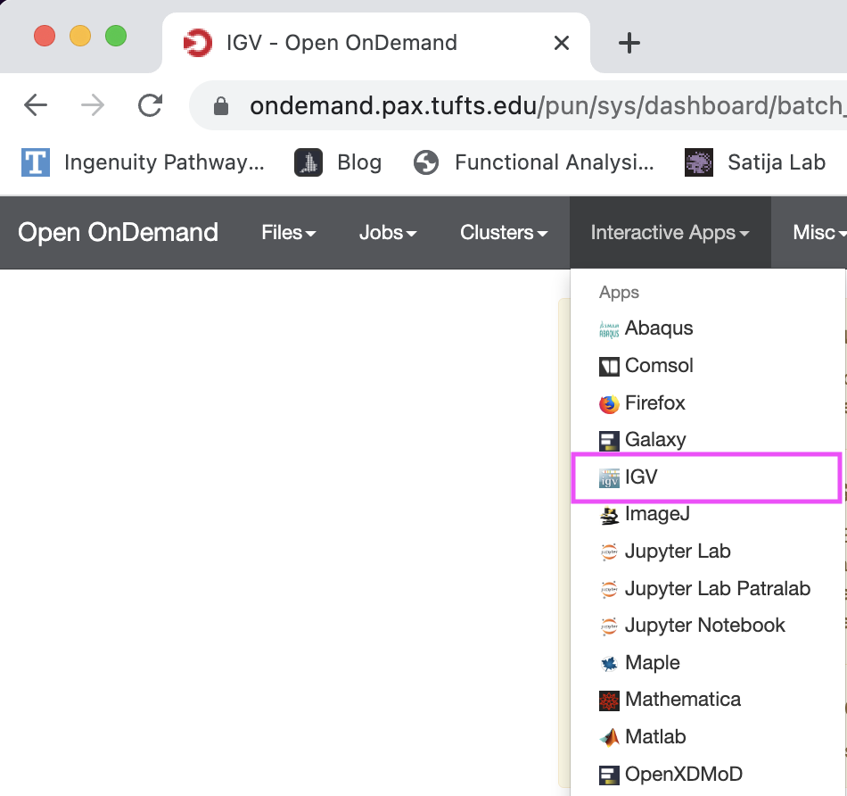
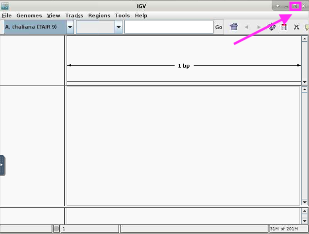
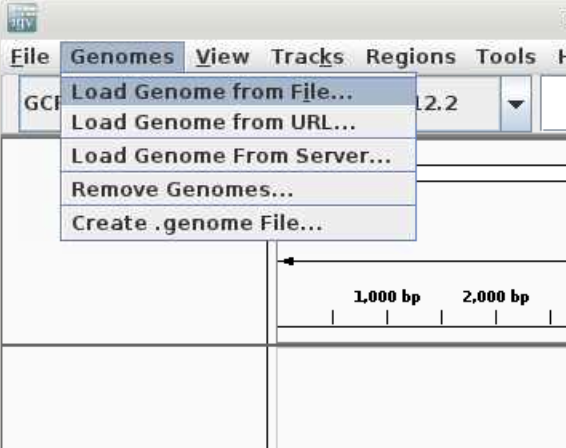
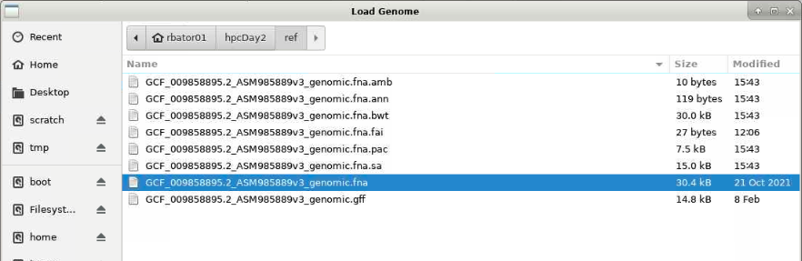
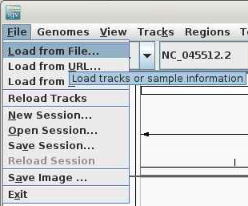
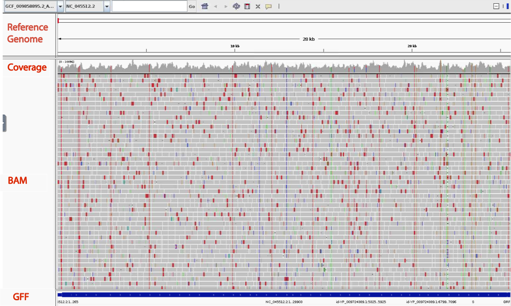
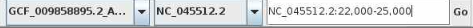
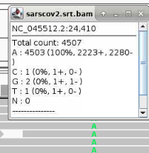

Approximate time: 10 minutes

## Learning Objectives
- View alignment, variants and reads using [Integrative Genomics Viewer](https://software.broadinstitute.org/software/igv/)

## BAM Visualization with IGV

- With a Chrome web browser, visit [https://ondemand.pax.tufts.edu/](https://ondemand.pax.tufts.edu/)
- Log in in with your Tufts credentials
- On the top grey menu bar, choose `Interactive Apps->IGV`.

-Choose the following compute resource parameters: 
-- Number of house = 1
-- Number of cores = 1
-- Amount of Memory = 8GB
-- Reservation = Bioinformatics Workshop
-- Directory (leave blank)

- Click the blue button `Launch IGV` when it appears

After this the IGV window will appear as a small window on a grey background.
Click the square icon in the top right corner to maximize the window.

### Load reference genome 

Choose reference genome by clicking the `Genomes` menu and selecting `Load Genome from File...`

Navigate from your home directory to `hpcDay2/data/` and select the fasta file `GCF_009858895.2_ASM985889v3_genomic.fna`

Click `Open`

You will see the name of the file and name of the sequence populate.

### Load the GFF file

Choose the GFF file by clicking on `File` menu and selecting `Load from File...`

As before, navigate to `hpcDay2/data/` and select the GFF file `GCF_009858895.2_ASM985889v3_genomic.gff` and click `Open`

### Load the BAM file

- Choose the BAM file by clicking on `File` menu and selecting `Load from File...`

- Navigate to `hpcDay2/results/` and select the sorted BAM file `sarscov2.srt.bam`

- Click `Open`

- It will take a minute or so to load all the reads. You can view progress in the lower right hand corner.

- When it's done, you will have the following view. Each row of data is called a track. There are four tracks visible: the top track shows the reference genome coordinates, followed by two tracks of our alignment (coverage and reads) followed by the GFF track showing the gene locations on our reference genome.

### Examining a Gene

- Zoom in on the Gene that encodes the Spike protein by hovering with your mouse on the genome track and clicking and dragging over the portion that is directly above the "S" protein.

- We should see the coordinate box show roughly basepairs 22,000-25,000 `NC_045512.2:22,000-25,000`.

- Looking at the Coverage track we see there are five positions that are colored, which indicates a basepair mismatch with respect to the references sequence in over 20% of the reads a that position. we will examine one more closely.

### Examining a Variant

- This region contains one of the 4 mutations that differentiate the delta variant from the originally characterized sequence. 

- Select region around the variant at 22,995.

- View  amino acid change is a T>K change at protein position 478, which corresponds to a C>A SNP at nucleotide position 22,995. 

- Explain hovering on a variant.

### Examining a Read

[Previous: Alignment ](lesson1.md)

[Next: Conclusion](lesson3.md)

