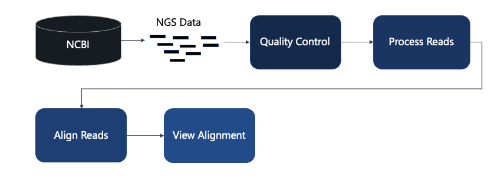

## Summary of Workshop

Further bioinformatics tutorials can be found here:
https://it.tufts.edu/research-technology/bioinformatics/bioinformatics-tutorials

Please reach out with questions on bioinformatics, to request a tutorial or to collaborate!

Research Technology: tts-research@tufts.edu
DISC: disc@tufts.edu

[Previous: View Alignment with IGV](lesson2.md) 

[Workshop Home Page](../../index.md)
