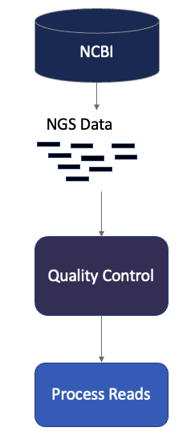

# NGS Data Download/QC

## Description

This is the first part of Day 2 of the High Performance Computing For Life Sciences workshop. Here we examine how to download publically available NGS data and perform quality control on that data.

### Goals

### Materials Needed

- Chrome web browserworkshop
- Account on [Tufts High Performance Compute Cluster](https://it.tufts.edu/research-technology/high-performance-computing)
- [VPN](https://access.tufts.edu/vpn) if accessing the HPC from off campus

## Prerequisite

- [Intro to Slurm (1 hour)](../IntroToSlurm/README.md)
- [Intro to Linux (1 hour)](../IntroToLinux/IntroToLinux1.md)

## Table of Contents

- [Background]()
- [Logging In (15 min)](lessons/lesson1.md)
- [Obtain Data (15 min)](lessons/lesson2.md)
- [Quality Control (15 min)](lesssons/lesson3.md)
- [Process Reads (15 min)](lessons/lesson4.md)

__________________________________________________________________________________________________________________________________________________________

[Workshop Home Page](../index.md)
