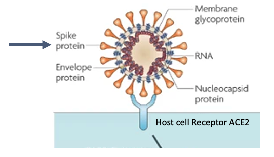
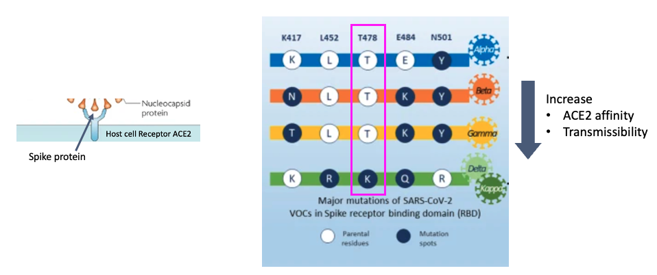
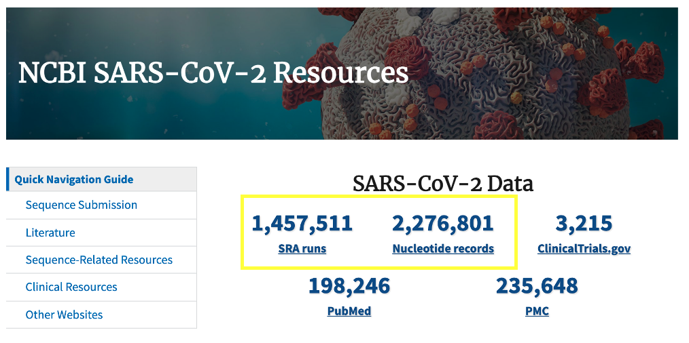
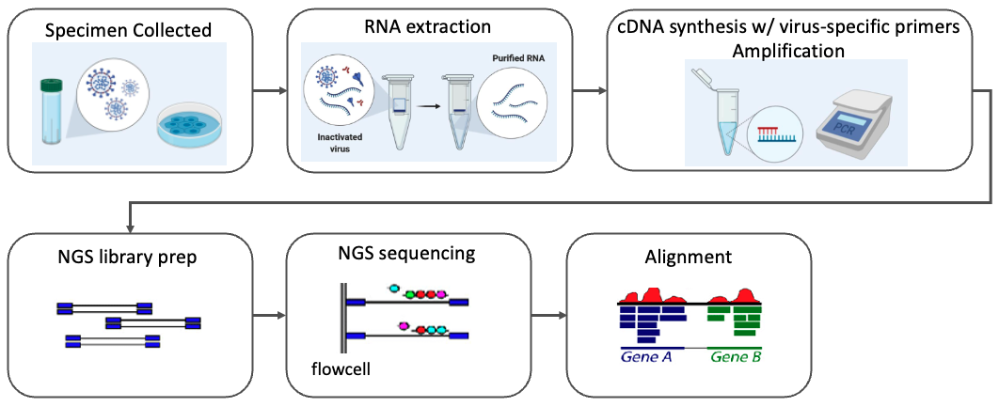
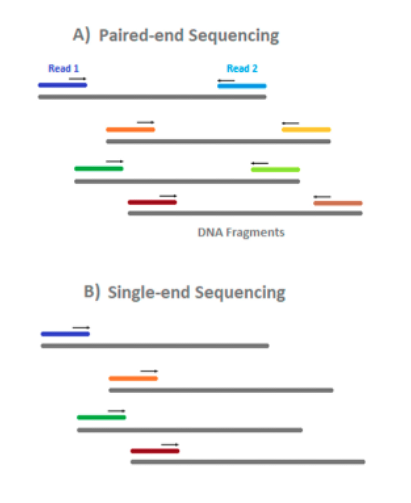

# Background

## SARS-CoV-2 Spike Protein

Severe acute respiratory syndrome-coronavirus (SARS-CoV) has an RNA genome, which encodes proteins necessary for it’s replication inside cells. The genome is contained in an envelope, which is studded with envelope and Spike proteins. It enters host cells when the receptor binding domain of the Spike protein binds to the host cell receptor angiotensin-converting enzyme 2 (ACE2)129, and the ACE2–virus complex enters the cell where downstream steps in the virus lifecycle take place. Viruses have a high mutation rate, and not surprisingly the Spike protein is under selective pressure to change the receptor binding domain in order to more readily infect cells.

## Variants of Concern (VOC)

There are several varaints of the originally characterized SARS-CoV-2 sequence. They contain 5 major mutations with respect to the original sequence, shown here. For example take T478, which is spike protein residue number 478 which is threonine (T) in the original sequence, and changes tolysine (K) in the delta variant. These mutations in the spike proteins have been shown to result in higher ACE2 affinity, transmissibility among other phenotypes that make them an increased thread to public health. Today, we’ll study a delta variant sample and compare these positions to the originally characterized sequence using bioinformatics methods.

## SARS-CoV-2 Resources

The US National Center for Biotechnology Information hosts repositories for many types of biomedical and genomics data. Today we'll retrieve reference data from the nucleotide repository, which contains among other things sequence records for SARS-CoV-2 genomes as well as the Sequence Read Archive (SRA) where raw next generation sequencing data can be easily obtained for reanalysis.

## Viral Genome Next Generation Sequencing (NGS)

Let's take a moment ot go through the Viral NGS Workflow. Total RNA is extracted from the sample, this contains both virus and host RNA. At this point a decision is made about downstream protocol based on whether the virus is known. In the case we will study, the authors are interested in sequencing SARS-CoV-2 which has a known sequence, so they can design virus specific primers which will capture SARS-CoV2 and not the host RNA, and transcribe it into complementary DNA which can be prepped for sequencing. Importantly, the primers they design will limit what they capture, so they must design the primers to bind in regions that they expect are conserved between viral variants. An amplification procedure has to be performed, because the current NGS technologies require a high input DNA amount and the viral genome amount is several orders of magnitude lower. Then, the preparation for NGS sequencing begins. We start with viral cRNA fragments that can be sequenced the same as DNA on an NGS sequencer. Sequencing adapters are added (these are the blue rectangles) that will allow the cDNA fragments to attach to the sequencing flowcell. I won’t go in depth through the sequencing process, but the sequence of the fragments is determined using fluorescently tagged nucleotides that emit a colored light signal when they attach to a base on the fragment being sequences. It is the optical signal that the instrument reads to determine which base in the sequence was read. 

## Types of Read Data

_______________________________________________________________________________________________________________________________________________

[Next](lesson2.md)

[Previous](../README.md)
