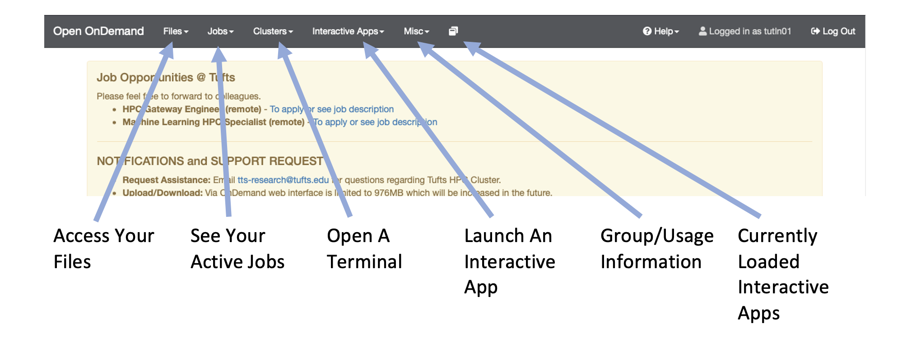
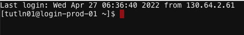

# Obtain Data

## Navigate to the Cluster

To get the Tufts HPC cluster you'll first need an account. If you haven't already done so please [request an account](https://tufts.qualtrics.com/jfe/form/SV_5bUmpFT0IXeyEfj) with Research Technology. You will also need to either be on a Tufts network or be connected to the [VPN](https://access.tufts.edu/vpn). Once you have an account and are connected to the VPN/Tufts Network, navigate to the [OnDemand Website](https://ondemand.pax.tufts.edu) and log in with your tufts credentials. Once you are logged in you'll notice a few navigation options:




## Open an Interactive Session

Now that we are logged in let's use the cluster! To start click on `Clusters > Tufts HPC Shell Access`. You'll notice the following: 



Where:
- tutln01 is your username
- @login-prod-01 is the node you are on

Now it is **IMPORTANT** to note that when you log in you are on the login node. This is a shared node, sort of like a waiting room. You can't run anything from this login node. For that you'll need to request compute resources so type and enter this into your terminal:

```
srun -p preempt -t 1-2:30:00 -n 1 --mem=2g --pty bash
```
So what did you do? Well you just used what is called a SLURM command. SLURM is what is known as a job scheduler and it is used to organize how jobs are run on the HPC. Let's break down what you did above:

|command/option|description|
|-|-|
|srun| runs a parallel job on the cluster|
|-p| identifies the partition you want to use - here we use the preempt parition|
|-t| How long do we want to use this resource? The format is in day-hour:minute:second, so here we requested 1 day, 2 hours, 30 minutes and 0 seconds|
|-n| How many CPU cores do we want to use? Here we asked for 1|
|--mem| How much memory do we want to use? Here we asked for 2 gigabytes|
|--pty| What kind of terminal do we want? Here we asked for a bash terminal|

Now you'll notice that the node has changed:

```
[tutln01@i2cmp008 ~]$ 
```
## Obtain Public NGS Data

The [US National Center for Biotechnology Information](https://www.ncbi.nlm.nih.gov/) (NCBI) hosts repositories for many types of biomedical and genomics data. Today we'll retrieve reference data from the [Genomes Database FTP server](https://ftp.ncbi.nlm.nih.gov/genomes/) as well as the [Sequence Read Archive](https://www.ncbi.nlm.nih.gov/sra). First `cd ` into the workshop directory you used in Day 1 of this workshop:

```
cd XXXX
```

Now we will use the `wget` command to download our reference data from the NCBI repository:

```
wget https://ftp.ncbi.nlm.nih.gov/genomes/all/GCF/009/858/895/GCF_009858895.2_ASM985889v3/GCF_009858895.2_ASM985889v3_genomic.fna.gz
wget https://ftp.ncbi.nlm.nih.gov/genomes/all/GCF/009/858/895/GCF_009858895.2_ASM985889v3/GCF_009858895.2_ASM985889v3_genomic.gff.gz
```
You will notice that both these files end in `.gz` - this indicates they are compressed. Compressing files is useful when storing data but to use it you will often need to decompress it with `gunzip -d`:

```
gunzip -d https://ftp.ncbi.nlm.nih.gov/genomes/all/GCF/009/858/895/GCF_009858895.2_ASM985889v3/GCF_009858895.2_ASM985889v3_genomic.fna.gz
gunzip -d https://ftp.ncbi.nlm.nih.gov/genomes/all/GCF/009/858/895/GCF_009858895.2_ASM985889v3/GCF_009858895.2_ASM985889v3_genomic.gff.gz
```

You will also notice that one file ends in `.fna` and the other ends in `.gff`. These are Fasta and GFF files, respectively.

### Fasta Format
The virus genome is in fasta format. Fasta format has two parts, a sequence identifier preceeded by a ">" symbol, followed by the sequence on subsequent lines.

<p align="center">

</p>


### GFF Format
The gene annotation file is in Generic Feature Format (GFF). This formet tells us where genes are located in the reference genome.
Note that we must always be sure that our gene information and genome come from the same source. 

<p align="center">

</p>
