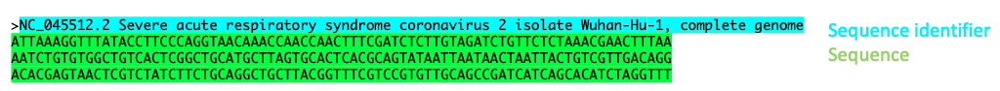
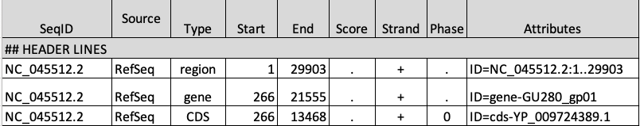
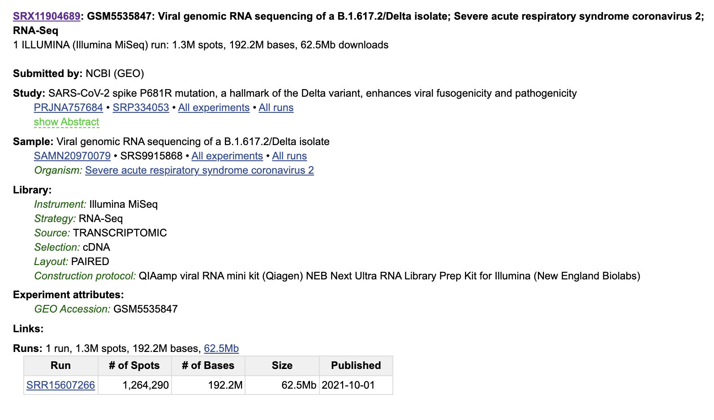
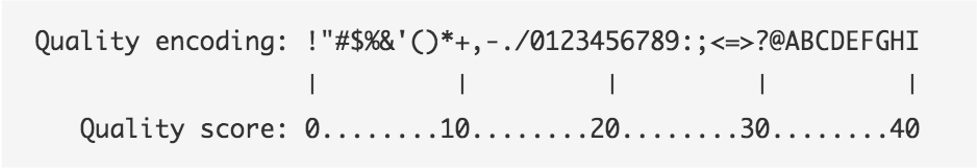

# Obtain Public NGS Data

## Learning Objectives

- Retrieve reference data from [US National Center for Biotechnology Information](https://www.ncbi.nlm.nih.gov/)
- Download SRA Next Generation Sequencing Data
- Understand Fasta, GFF, and Fastq file formats

The [US National Center for Biotechnology Information](https://www.ncbi.nlm.nih.gov/) (NCBI) hosts repositories for many types of biomedical and genomics data. Today we'll retrieve reference data from the [Genomes Database FTP server](https://ftp.ncbi.nlm.nih.gov/genomes/) as well as the [Sequence Read Archive](https://www.ncbi.nlm.nih.gov/sra). 


## SARS-Cov-2 Reference Data

### Download Reference Data

We will use the `wget` command to download our reference data from the NCBI repository:

```
wget https://ftp.ncbi.nlm.nih.gov/genomes/all/GCF/009/858/895/GCF_009858895.2_ASM985889v3/GCF_009858895.2_ASM985889v3_genomic.fna.gz
wget https://ftp.ncbi.nlm.nih.gov/genomes/all/GCF/009/858/895/GCF_009858895.2_ASM985889v3/GCF_009858895.2_ASM985889v3_genomic.gff.gz
```
You will notice that both these files end in `.gz` - this indicates they are compressed. Compressing files is useful when storing data but to use it you will often need to decompress it with `gunzip -d`:

```
gunzip -d https://ftp.ncbi.nlm.nih.gov/genomes/all/GCF/009/858/895/GCF_009858895.2_ASM985889v3/GCF_009858895.2_ASM985889v3_genomic.fna.gz
gunzip -d https://ftp.ncbi.nlm.nih.gov/genomes/all/GCF/009/858/895/GCF_009858895.2_ASM985889v3/GCF_009858895.2_ASM985889v3_genomic.gff.gz
```

You will also notice that one file ends in `.fna` and the other ends in `.gff`. These are Fasta and GFF files, respectively.

### Fasta Format
The virus genome is in fasta format. Fasta format has two parts, a sequence identifier preceeded by a ">" symbol, followed by the sequence on subsequent lines.

<p align="center">

</p>


### GFF Format
The gene annotation file is in Generic Feature Format (GFF). This formet tells us where genes are located in the reference genome.
Note that we must always be sure that our gene information and genome come from the same source. 

<p align="center">

</p>

## SARS-Cov-2 NGS Sequencing Data

We are interested in obtaining reads from the sample [Viral genomic RNA sequencing of a B.1.617.2/Delta isolate; Severe acute respiratory syndrome coronavirus 2; RNA-Seq](https://www.ncbi.nlm.nih.gov/sra/?term=SRR15607266)
<p align="center">

</p>

### Download NGS Sequencing Data

To download our NGS Data we will need to load the sratoolkit module. We can access this module by running:

```
module load sra/2.10.8
```
Now that we have this module loaded we can use it to pull our SARS-Cov-2 NGS sequencing data from the [SRA database](https://www.ncbi.nlm.nih.gov/sra):

```
fastq-dump --outdir fastq --gzip --skip-technical  --readids --read-filter pass --dumpbase --split-files --clip SRR15607266
```


### Fastq format
Fastq format is a way to store both sequence data and information about the quality of each sequenced position.

Each block of 4 lines contains one sequencing reads, for example:
```
@SRR15607266.1 1 length=76
NTTATCTACTTTTATTTCAGCAGCTCGGCAAGGGTTTGTTGATTCAGATGTAGAAACTAAAGATGTTGTTGAATGT
+SRR15607266.1 1 length=76
#8ACCGGGGGGGGGGGGGGGGGGGGGGGGGGGGGGGGGGGGGGGGGGGGGGGGGGGGGGGGGGGGGGGGGGGGGGG
```

1. Sequence identifier
2. Sequence
3. \+ (optionally lists the sequence identifier again)
4. Quality string

Paired end sequencing data will typically be stored as two fastq files, one for the forward and one for the reverse.  Each file should contain the same number of reads, with the same labels, in the same order. If this convention is not followed, it could cause errors with downstream tools. Fortunately there are tools such as [BBTools Repair](https://jgi.doe.gov/data-and-tools/bbtools/bb-tools-user-guide/repair-guide/) that can help restore pairing information.

### Base Quality Scores

The symbols we see in the read quality string are an encoding of the quality score:



A quality score is a prediction of the probability of an error in base calling: 


Going back to our read, we can see that for most of our read the quality score is "G" –> "Q" =  38 -> Probability < 1/1000 of an error.

_________________________________________________________________________________________________________________________________________________________

[Next](lesson3.md)

[Previous](lesson1.md)
