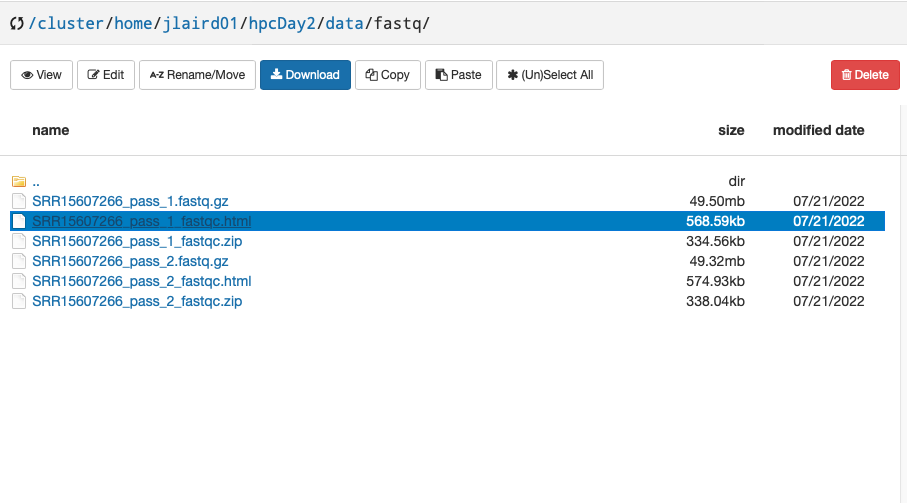
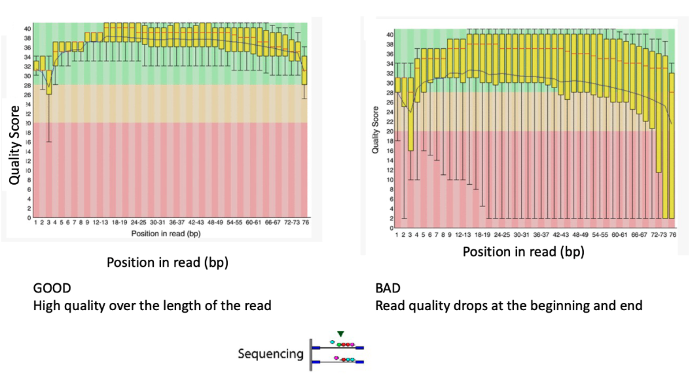
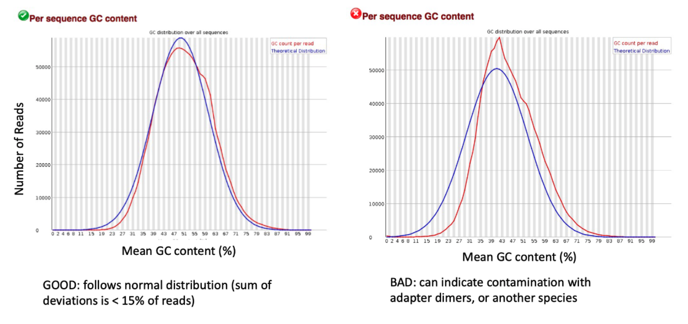
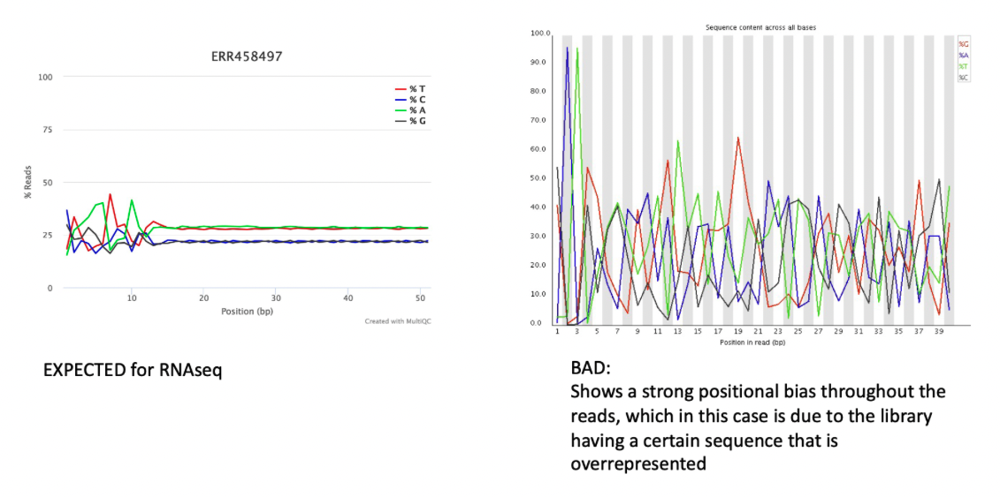
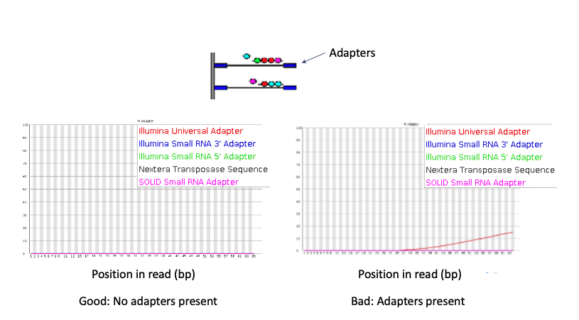
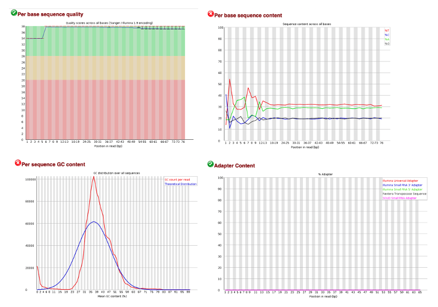

# Quality Control

## Learning Objectives

- Perform quality control on NGS data using FastQC
- Understand what are expected FastQC metrics
- Interpret FastQC metrics from SARS-CoV-2 NGS data

## FastQC

Next Generation Sequencing can produce a large number of reads in each experiment, giving low-cost and in-depth information about the underlying RNA or DNA sample. However, every platform will produce errors (incorrect nucleotides in the sequence). Hence, quality control is an important step in data analysis. FastQC provides several modules to asses the quality of sequencing data:

- Sequence Quality
- GC content
- Per base sequence content
- Adapters in Sequence

To run FastQC we will need to load the FastQC module:

```
module load fastqc/0.11.9
```

Now that we have it loaded we can run FastQC on our sequencing data:

```
fastqc *.fastq.gz
```

After running FastQC, you will notice several files in your directory:

```
ls
```
> ```
> SRR15607266_pass_1_fastqc.html  SRR15607266_pass_1.fastq.gz     SRR15607266_pass_2_fastqc.zip
> SRR15607266_pass_1_fastqc.zip   SRR15607266_pass_2_fastqc.html  SRR15607266_pass_2.fastq.gz
> ```

To investigate the quality of our sequence, we will need to view the `.html` file that was produced. Navigate to the OnDemand Tab and click on `Files > Home Directory`:


Now navigate to this workshop's directory and right click on `SRR15607266_pass_1_fastqc.html` and select `Open Link in New Tab`:



## FastQC Output

Before we dive into these plots let's discuss what is a "good" quality control plot and what is not. 

### Sequence Quality



### GC Content



### Per base sequence content



### Adapters in Sequence



### So How About Our Own Data?



Here we note that our quality scores are high and no adapters are present in our sample. However, the GC content and the Per base sequence content metrics have failed. This could be due to human contamination or overepresented sequences sequences like polyA tails.
_________________________________________________________________________________________________________________________________________________________

[Next](lesson5.md)

[Previous](lesson3.md)
