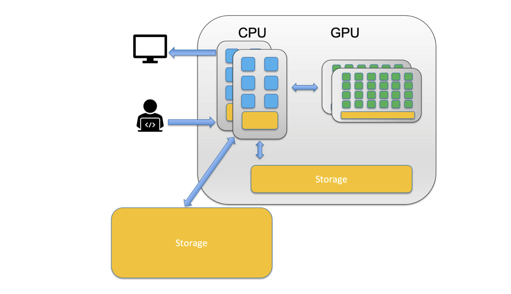
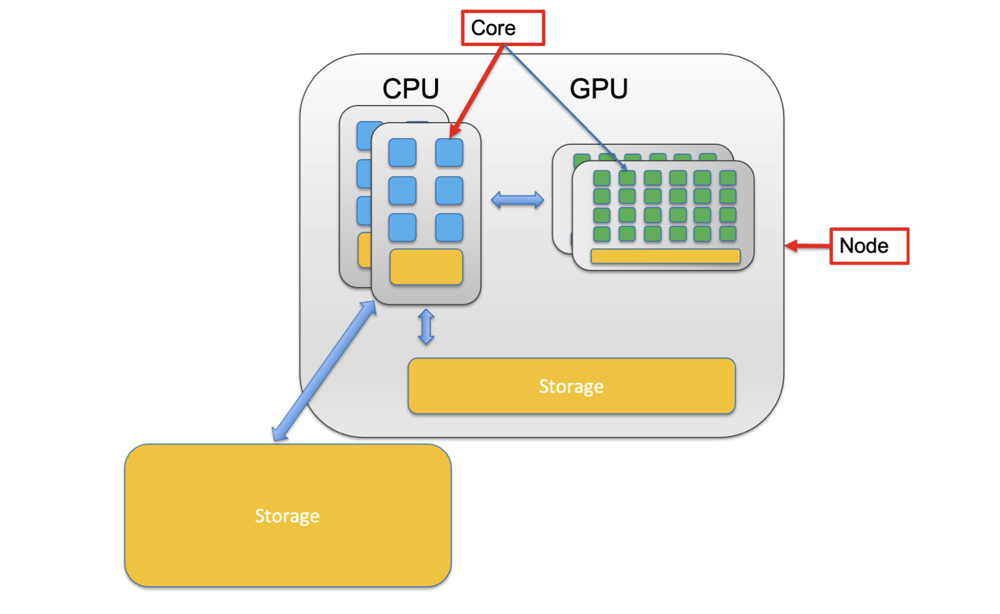
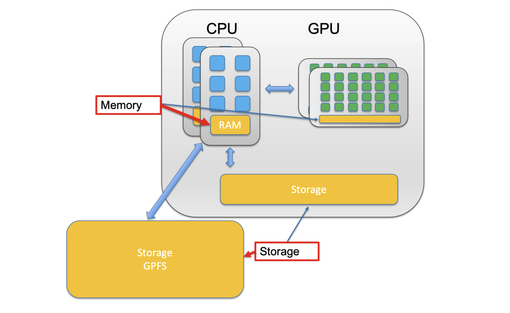
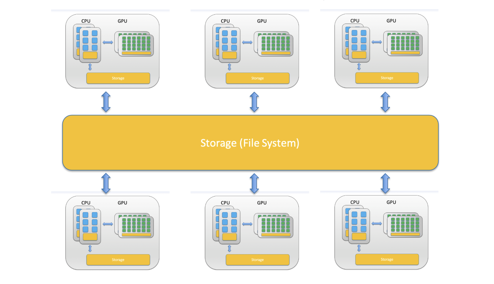
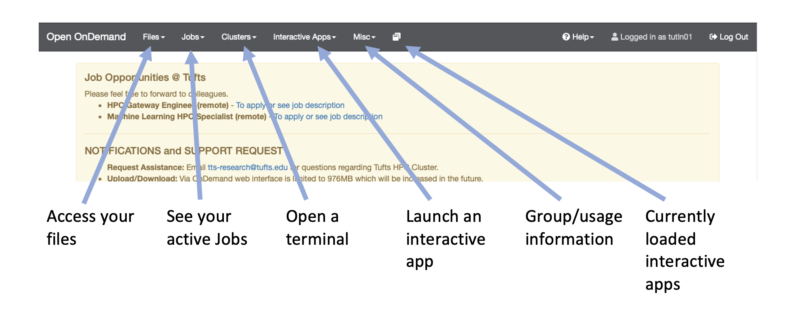
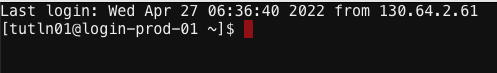

## What is the Cluster?

Before getting to the cluster it is worth discussing what a cluster is and some of the terminology. First, let's discuss the difference between a CPU and a GPU.

### CPU -- Central Processing Unit
  - A CPU can never be fully replaced by a GPU
  - Can be thought of as the taskmaster of the entire system, coordinating a wide range of general-purpose computing tasks
### GPU -- Graphics Processing Unit
  - GPUs were originally designed to create images for computer graphics and video game consoles
  - Performing a narrower range of more specialized tasks
  - 


You'll notice that in the picture above the CPU is composed of a smaller unit, a **core**. A core is the computing unit in a CPU. You'll also note that the whole system (including CPUs, GPUs and Storage) is a single computer in the system called a **node**.



When a CPU performs some computation they use a storage hierarchy. This hierarchy places small/fast storage options close to the CPU and slower/larger options away from the CPU. These small/fast options are called **memory/RAM** while the slower/larger options are simply called **storage**.



Now that we now the components we can put together an image of what a computer cluster is. A **computer cluster** is a group of loosely or tightly connected computers that work together as a single system. A **HPC (High Performance Compute) cluster** is a computer cluster capable of performing computations at high speeds.




what is a cluster
getting to onDemand
what is linux

## Navigate to the Cluster

To get the Tufts HPC cluster you'll first need an account. If you haven't already done so please [request an account](https://tufts.qualtrics.com/jfe/form/SV_5bUmpFT0IXeyEfj) with Research Technology. You will also need to either be on a Tufts network or be connected to the [VPN](https://access.tufts.edu/vpn). Once you have an account and are connected to the VPN/Tufts Network, navigate to the [OnDemand Website](https://ondemand.pax.tufts.edu) and log in with your tufts credentials. Once you are logged in you'll notice a few navigation options:




## Open an Interactive Session

Now that we are logged in let's use the cluster! To start click on `Clusters > Tufts HPC Shell Access`. You'll notice the following: 



Where:
- tutln01 is your username
- @login-prod-01 is the node you are on

Now it is **IMPORTANT** to note that when you log in you are on the login node. This is a shared node, sort of like a waiting room. You can't run anything from this login node. For that you'll need to request compute resources so type and enter this into your terminal:

```
srun -p preempt -t 1-2:30:00 -n 1 --mem=2g --pty bash
```
So what did you do? Well you just used what is called a SLURM command. SLURM is what is known as a job scheduler and it is used to organize how jobs are run on the HPC. Let's break down what you did above:

|command/option|description|
|-|-|
|srun| runs a parallel job on the cluster|
|-p| identifies the partition you want to use - here we use the preempt parition|
|-t| How long do we want to use this resource? The format is in day-hour:minute:second, so here we requested 1 day, 2 hours, 30 minutes and 0 seconds|
|-n| How many CPU cores do we want to use? Here we asked for 1|
|--mem| How much memory do we want to use? Here we asked for 2 gigabytes|
|--pty| What kind of terminal do we want? Here we asked for a bash terminal|

Now you'll notice that the node has changed:

```
[tutln01@i2cmp008 ~]$ 
```

## Orienting Yourself in Terminal

Now that we have a compute node we can start entering commands, specifically linux commands. Linux is an operating system and Linux commands are widely used in life science pipelines. This interface where you enter commands is called the command line interface or just command line. Let's start by figuring out where we are using `pwd`:

```
[tutln01@i2cmp008 ~]$ pwd
/cluster/home/tutln01
```
So we can see that we are in a folder called `tutln01` inside another folder called `home` inside another called `cluster`. The command we used, `pwd` is to print the working directory and tell us where we currently are. Now let's find out what files are in the `tutln01` folder with `ls`:

```
[tutln01@i2cmp008 ~]$ ls
```
chances are if this is your first time in the Tufts HPC cluster you won't have any files in your home folder. Let's change that by copying over the data we will need for this tutorial with `cp`:

```
[tutln01@i2cmp008 ~]$ cp -R /cluster/tufts/bio/tools/tool_examples/introHPC ./
```

So we have copied an entire folder to our working directory. You will notice we needed to use what is called an option after `cp`. This makes sure we are copying everything in the folder. We can now use `ls` again to see what is in our working directory:

```
[tutln01@i2cmp008 ~]$ ls
introHPC
```
Now that we have entered quite a few commands, we may want to clean up the screen. We can do that with `clear`:

```
[tutln01@i2cmp008 ~]$ clear
```
You'll notice that all your previous commands have disappeared giving you more space to enter new commands!

____________________________________________________________________________________________________________________________________________________

[Next](./introHPC2.md)

[Previous](./introHPC0.md)
