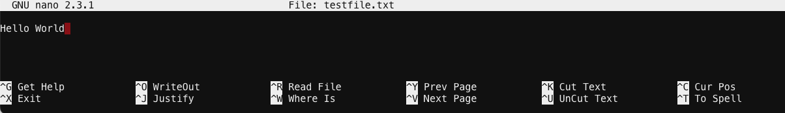
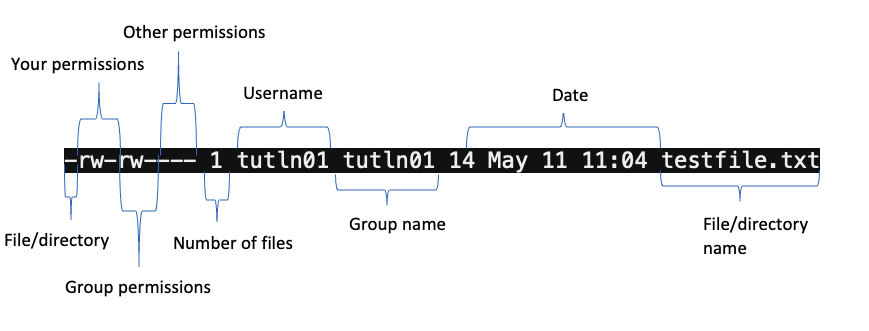

# Working with Files and Shortcuts

## Navigation

In Finder/File Explorer you can simply click on the file/folder to open it. At the command line interface you need to enter a command for that. To "click" into out `introHPC` folder we use the `cd` command:

```
[tutln01@i2cmp008 ~]$ cd introHPC
[tutln01@i2cmp008 introHPC]$ 
```
You'll notice that when you change directories to the introHPC directory the name `introHPC` comes after the node name instead of `~`. This is because `~` is an alias for your home directory. If you wanted to get back to your home directory you can enter:

```
[tutln01@i2cmp008 introHPC]$ cd ~
[tutln01@i2cmp008 ~]$ cd introHPC
[tutln01@i2cmp008 introHPC]$
```

Now say you don't want to move all the way back to your home directory. What if you wanted to move only one or  two folders up? You can do that with:

```
[tutln01@i2cmp008 introHPC]$ cd ../
[tutln01@i2cmp008 ~]$
```

Each `../` will move you up one folder - so `../` will move you up one folder, `../../` will move you up two and so on. Now it is often preferable to navigate by specifying the **path** to get to a folder. So let's try to get to the `data` folder in the `introHPC` folder using the full and relative paths:

```
[tutln01@i2cmp008 ~]$ cd /cluster/home/tutln01/introHPC/data
[tutln01@i2cmp008 data]$ cd ~
[tutln01@i2cmp008 ~]$ cd ./introHPC/data
[tutln01@i2cmp008 data]$ 
```
You'll notice that we got to the `data` folder two ways: 
1. by using the full path starting from the very first folder
2. by using the relative path starting from the folder we were in

Often times it is preferable to use the full path, just to avoid any ambiguity as to where your data is. 

## Viewing Files

Once in our data folder we can take a look around:

```
[tutln01@i2cmp008 data]$ ls
accession.txt  SRR1552453.fastq.gz  SRR1552454.fastq.gz  SRR1552455.fastq.gz
```
We see four files here, three fastq files and one txt file. We can see what is inside our files using the `cat` command:

```
[tutln01@i2cmp008 data]$ cat accession.txt
SRR1552453 
SRR1552454 
SRR1552455
```

Now our fastq files are going to be a little trickier. They are not only compressed (you can tell because they end in `.gz`) but they are long too. We can read a compressed file with `zcat` and we will only show the first 6 lines with `head`:

```
[tutln01@i2cmp008 data$ zcat SRR1552454.fastq.gz | head
@SRR1552454.1 DCV4KXP1:223:C2CTUACXX:2:1101:1469:2188 length=100
GAAATACAGAACCTGTTGATGTTGATATCTGTGCTCAGCTATGTAGCATCTTTCTCTCTGTTAAGCCTGGTCAACATTAACCCAATGAAATGATTTGAAG
+SRR1552454.1 DCV4KXP1:223:C2CTUACXX:2:1101:1469:2188 length=100
B@@FFFFFHHHHHJJJJJIIJGIJIIIIJJJJGGIJGIIJJJJJJJJIIIJJJIJJJIJJJJJIIIJJJJJJJJJGHIJAGIHHHHFFFFFFEEEEEDED
@SRR1552454.2 DCV4KXP1:223:C2CTUACXX:2:1101:1435:2189 length=100
GGACAAGCCATGCCAAAGCCAAGGCAGAGGCAGCAGAACAGGCTGCCCTGGCTGCCAACCAGGAGTCCAACATCGCCCGTACATTGGCCAAGGAGCTGGC
+SRR1552454.2 DCV4KXP1:223:C2CTUACXX:2:1101:1435:2189 length=100
CCCFFFFFHHHHHJJJJJIJJJJJJIJIJJJGGIJJJJJJJJJJIIJJJJJJJJIJEHHHGFFFDAEECEDD?CBB?B@;>B?CDCDDDABBDBBBBDDD
@SRR1552454.3 DCV4KXP1:223:C2CTUACXX:2:1101:1549:2196 length=100
GAAATCCTTTCAAAATAGTGTTATTAACCTGATTAAAGAACTGCAAATAAAATCAAGCTGTAACTGCCCAGAATTCCATTTAAGTTACAGCCTGATTTTA
```
You'll notice that we did something new here - we combined two commands together using `|`. This is called piping commands and it is very useful when creating complex commands so you don't need to type one command after the other. 

## Creating/Deleting Files/Directories

Now what if we wanted to create a new file or directory? We can create a new file with `touch` and a new directory with `mkdir`:

```
[tutln01@i2cmp008 data]$ touch testfile.txt
[tutln01@i2cmp008 data]$ ls
accession.txt  SRR1552453.fastq.gz  SRR1552454.fastq.gz  SRR1552455.fastq.gz testfile.txt
```
If we want to add to this new file we need a text editor. We will use nano to edit our file so enter:

```
[tutln01@i2cmp008 data]$ nano testfile.txt
```
Now write whatever you like! Here we write `Hello World`:



To exit and save just hit `Esc` + `Cntl` + `x` then then hit `y` and then `Enter`. You can learn more about editing with nano [here](https://www.nano-editor.org/dist/latest/cheatsheet.html). Now say you want to remove this file or directory. You can do so with the `rm` command:

```
[tutln01@i2cmp008 data]$ rm testfile.txt
[tutln01@i2cmp008 data]$ ls
accession.txt  SRR1552453.fastq.gz  SRR1552454.fastq.gz  SRR1552455.fastq.gz
```

**Use this command carefully** as deleting is permanent. If you want to delete a directory you can do so with `rm -r directoryToDelete`

## Permissions

Oftentimes you will be working with others on a project and sometimes they will need access to your files/directories. Let's demonstrate this by creating your own file and checking it's permissions with `ll`:


```
[tutln01@i2cmp008 data]$ touch testfile.txt
[tutln01@i2cmp008 data]$ ll testfile.txt
-rw-rw---- 1 tutln01 tutln01 14 May 11 11:04 testfile.txt
```

You will notice a few things:


There are a few permissions status':

- `-` no permission status
- `r` read permission
- `w` write permission
- `x` execute permission

We can change these with the `chmod` command:

```
[tutln01@i2cmp008 data]$ chmod ugo+rwx testfile.txt
[tutln01@i2cmp008 data]$ ll testfile.txt
-rwxrwxrwx 1 tutln01 tutln01 14 May 11 11:04 testfile.txt
```

Here we chaged permissions for everyone - yourself (`u`), your group (`g`), and all others (`o`). We can add permissions with `+` and take them away with `-`:
```
[tutln01@i2cmp008 data]$ chmod o-rw testfile.txt
[tutln01@i2cmp008 data]$ ll testfile.txt
-rwxrwxrw- 1 tutln01 tutln01 14 May 11 11:04 testfile.txt
```

Here we removed other user's ability to execute this file.

_______________________________________________________________________________________________________________________________________________________

[Next](./introHPC3.md)

[Previous](./introHPC1.md)
